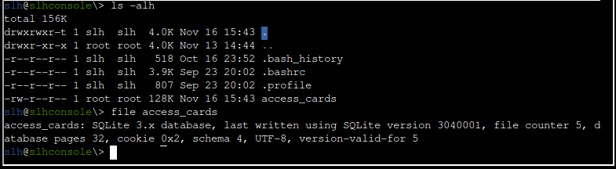

# Act 1

There are two items on this map. One is a UV flashlight and the other is a book which can be viewed at <https://frost-y-book.com/>. It is advisable to collect them as they will come in useful for the challenges here.


## cURLing

This challenge is a quiz around the use of the `curl` command line utility.

)

**FOR SILVER AWARD**, one needs to achieve certain objectives by using `curl` correctly. Here are the questions and answers:

1. Unlike the defined standards of a curling sheet, embedded devices often have web servers on non-standard ports.  Use curl to retrieve the web page on host "curlingfun" port 8080.
   - `curl "http://curlingfun:8080"`
2. Embedded devices often use self-signed certificates, where your browser will not trust the certificate presented.  Use curl to retrieve the TLS-protected web page at https://curlingfun:9090/
   - `curl -k "https://curlingfun:9090"`
3. Working with APIs and embedded devices often requires making HTTP POST requests. Use curl to send a request to https://curlingfun:9090/ with the parameter "skip" set to the value "alabaster", declaring Alabaster as the team captain.
   - `curl -k -X POST "https://curlingfun:9090/" -d "skip=alabaster"`
4. Working with APIs and embedded devices often requires maintaining session state by passing a cookie.  Use curl to send a request to https://curlingfun:9090/ with a cookie called "end" with the value "3", indicating we're on the third end of the curling match.
   - `curl -k -X POST "https://curlingfun:9090/" -b "end=3"`
5. Working with APIs and embedded devices sometimes requires working with raw HTTP headers.  Use curl to view the HTTP headers returned by a request to https://curlingfun:9090/
   - `curl -k -I "https://curlingfun:9090/"`
6. Working with APIs and embedded devices sometimes requires working with custom HTTP headers.  Use curl to send a request to https://curlingfun:9090/ with an HTTP header called "Stone" and the value "Granite".
   - `curl -k  "https://curlingfun:9090/" -H "Stone: Granite"`
7. curl will modify your URL unless you tell it not to.  For example, use curl to retrieve the following URL containing special characters: https://curlingfun:9090/../../etc/hacks
   - `curl -k 'https://curlingfun:9090/%2E%2E/%2E%2E/etc/hacks'`


The instruction for **GOLD AWARD** can be found in the file `HARD-MODE.txt` in the current directory.

)

This is the `curl` request meeting the above requirements: `curl -k -X POST "https://curlingfun:9090/" -d "skip=bow" -b "end=10" -H "Hack: 12ft"`

This request returns the following message:

```
Excellent!  Now, use curl to access this URL: https://curlingfun:9090/../../etc/button
```

The next request needs to be URL-encoded: `curl -k 'https://curlingfun:9090/%2E%2E/%2E%2E/etc/button'`

```
Great!  Finally, use curl to access the page that this URL redirects to: https://curlingfun:9090/GoodSportsmanship
```

Since re-direction is involved, the `-L` option should be used: `curl -k -L 'https://curlingfun:9090/GoodSportsmanship'`

)

## Frosty Keypad

In this challenge, the user to enter the correct codes in order to unlock the safe and achieve the Silver or Gold awards. The UV flashlight will be shown next to the keypad if he has picked up the item.

)

This safe is protected by a 5 digit code. By clicking and dragging the flashlight over the keypad, fingerprints will be revealed over the keys **2, 6, 7 and 8**. The correct 5-digit codes very likely consist of these four digits.

Numbers are written on a slip of paper stuck on the safe:

- 2:6:1
- 4:19:3
- 6:1:1
- 3:10:4
- 14:8:3

The triplets are clues for the code for **SILVER AWARD**. They refer to letters in the book item that can be picked up on the map and viewed at <https://frost-y-book.com/>. For example, "4:19:3" refers to **page 4**, **19th word**, **3rd letter** in the book, which is the letter "A" from the word "WHAT".

)

Proceeding in the same way for the other triplets, the word "SANTA" is formed. Coincidentally, "SANTA" is a word of length 5, same as the number of digits in the code for the safe. This is a clue to the format of the code for the safe - there are 4 distinct letters in "SANTA", with the 2nd and 5th letters ("A") repeated. The safe's code is likely to be of the same form, with 4 distinct digits "2", "6", "7" and "8", and one of these digits being repeated in the 2nd and 5th positions. For example, a possible code is "76286".

If this is the case, there are altogether 24 possibilities, because to form such codes, there are 4 choices for the digit at position "A" in "SANTA", and then there will be 3 choices for the digit "S", then 2 choices for the digit at "N", etc., giving us a total of 4 \* 3 \* 2 = 24 possibilities. This is not difficult to brute force and can even be done manually, directly on the keypad.

Still, it is useful to automate this since the same script can be modified and re-used for the Gold award code. From the "Network" tab in the browser's developer mode, one can observe how the code is sent to the server and checked. It is done through the HTTP POST request to `https://hhc24-frostykeypad.holidayhackchallenge.com/submit?id=00000000-0000-0000-0000-000000000000`, with the `id` parameter set to some value. The body contains the submitted code in JSON format, for example:

```
{"answer":"76286"}
```

For incorrect guesses, the response contains another JSON structure with an error message:

```
{"error":"The data you've provided seems to have gone on a whimsical adventure, losing all sense of order and coherence!"} 
```

A script can be written to automate code guesses. [This Python script](files/Act1/bruteforce.py) sends all of the 24 possiblities to the server and outputs the raw JSON response. The POST requests work even when the `id` parameter is set to `null`, but the `Content-Type` header should be set to `application/json`. Also, the script throttles the requests to a rate of less than 1 request per second through a `sleep` function as the server is observed to limit the rate of requests from IP addresses.

The correct code for **SILVER AWARD** is **72682**. The server returns the response of `{"output":"success"}` when the correct guess is sent.

For the **GOLD AWARD** code, the brute-forcing script needs to be modified. Assuming this 5-digit code uses the same digits "2", "6", "7" and "8", there are altogether 4 \* 4 \* 4 \* 4 \* 4 = 1024 possibilities (1023 if the Silver award "72686" code is excluded). At about 1 second per try, brute-forcing is still feasible, but the script needs to be modified. [This other Python script](files/Act1/bruteforce_gold.py) sends guesses to the server at a rate of 1 per second and stops once the correct code is found.

The correct code for **GOLD AWARD** is **22786**.

## Hardware Hacking Part 1

After completing the easy mode for the Frosty Keypad challenge, Morcel Nougat and Jewel Loggins will provide useful pointers to help solve the Hardware Hacking Part 1. The first is an archive of 1000 jpg images each of dimension 1x100 here: <https://holidayhackchallenge.com/2024/shreds.zip>, available as an items. The second is the Python script named `heuristic\_edge\_detection.py`, made available through a [link](https://gist.github.com/arnydo/5dc85343eca9b8eb98a0f157b9d4d719) in the hints. 

Unzipping the archive and running the provided Python script produces a png file named [`assembled_image.png`](files/Act1/assembled_image.png).


Reading off the text in the image, the correct settings for the first part of this challenge are:

- Baud: 115200 
- Parity: Even 
- Data: 7 bits 
- Stop bits : 1 bit 
- Flow Control: RTS 

**FOR SILVER AWARD**, follow these steps:

1. Connect the USB cable to the UART bridge.
2. Connect the jumper wires correctly between the devices. Colours do not matter:
   - Ground (GND on the UART bridge) should connect to the G pin on the device
   - VCC on the UART bridge should connect to the V pin on the device
   - Transmit (TX on the UART bridge) should connect to the R pin on the device
   - Receive (RX on the UART bridge) should connect to the T pin on the device
3. Switch the voltage on the UART bridge to 3V.
4. Power up by clicking the "P" button.
5. Select the appropriate baud, parity settings, etc. The "Port" setting should be set to "USB0".
6. Click on the "S" button to connect to the device.


The clue for **GOLD AWARD** can be found in the Javascript code `main.js` for this challenge. This can be view under the "Debugger" tab in the browser's developer mode (Firefox is used here).


The comment in the code mention that v1 of the API "should" be removed. Perhaps it is not? This API call helps to check if the connection settings are correct by querying the server via a POST request. This request is sent whenever the "S" button is pressed. By observing the network traffic in the "Network" tab of the browser's developer mode, it can be seen that this API call is sent to the endpoint <https://hhc24-hardwarehacking.holidayhackchallenge.com/api/v2/complete>, with a JSON formatted structure in the body:

```
{"requestID":"00000000-0000-0000-0000-000000000000","serial":[3,9,2,2,0,3],"voltage":3} 
```

The path for the v1 API is very similar to that for the current API, as seen in line 875 of the code. Indeed, for **GOLD AWARD**, just send the correct settings to the v1 API endpoint, i.e. <https://hhc24-hardwarehacking.holidayhackchallenge.com/api/v1/complete>. This can be done in interception proxies such as  Burp or mitmproxy. Incidentally, for this challenge, Firefox's developer mode can be used too. After connecting up the wires CORRECTLY, configuring the CORRECT settings and clicking "S" (exactly as for Silver award), go to the "Network" tab in Firefox's developer mode, right click the POST request that was just sent to <https://hhc24-hardwarehacking.holidayhackchallenge.com/api/v2/complete>, and click on "Edit and Resend". Then change "v2" to "v1" in the URL path, and re-send this request.

## Hardware Hacking Part 2

**FOR SILVER AWARD**, the user is required to set access permissions for the card with `id = 42` using the `slh` binary (Santa's Little Helper). Changes are password protected, but the password can be view in the `.bash_history` file once the user is booted into the card access system.


The password "CandyCaneCrunch77" was used by a previous user and captured in the bash history file. To set enable access for the card with `id = 42`, run the following command: `slh --passcode CandyCaneCrunch77 --set-access 1 --id 42`


For **GOLD AWARD**, one needs to be modify the access card database directly to change the access permissions for the card with `id = 42`. This database is stored in the `access_cards` file and is an SQLite database. 



Also provided in the hint is a [link to a CyberChef page](https://gchq.github.io/CyberChef/#recipe=HMAC(%7B'option':'UTF8','string':''%7D,'SHA256')) for the calculation of HMAC.

Fortunately, this database can be viewed and edited with the help of `sqlite3` which is available on the system and some basic SQL statements.


There are two tables in the database - `access_cards` and `config`. The `config` table stores the HMAC secret key `9ed1515819dec61fd361d5fdabb57f41ecce1a5fe1fe263b98c0d6943b9b232e` which would be useful for HMAC generation. it also explains what is being hashed to generate the HMAC, i.e. `access` and `uuid` fields in the `access_cards` database. The uuid field is in the second column of the `access_cards` database, and we can view this information for `id = 42`.


With the following information, the HMAC for the updated entry can be generated from CyberChef.


- HMAC secret key: `9ed1515819dec61fd361d5fdabb57f41ecce1a5fe1fe263b98c0d6943b9b232e`
- Input: `1c06018b6-5e80-4395-ab71-ae5124560189`
- Generated HMAC: `135a32d5026c5628b1753e6c67015c0f04e26051ef7391c2552de2816b1b7096`

Finally, the access status for the card with `id = 42` can be changed using the SQL statement `update access_cards set access=1, sig="135a32d5026c5628b1753e6c67015c0f04e26051ef7391c2552de2816b1b7096" where id=42;`. Note that the sig field has to be in quotes because this is a TEXT field, as revealed in the schema.


