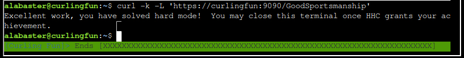

# Act 1

There are two items on this map. One is a UV flashlight and the other is a book which can be viewed at <https://frost-y-book.com/>. It is advisable to pick them up as they will come in useful for the challenges here.


## cURLing

This challenge is a quiz around the use of the `curl` command line utility.

)

**FOR SILVER AWARD**, one needs to achieve certain objectives by using `curl` correctly. Here are the questions and answers:

1. Unlike the defined standards of a curling sheet, embedded devices often have web servers on non-standard ports.  Use curl to retrieve the web page on host "curlingfun" port 8080.
   - `curl "http://curlingfun:8080"`
2. Embedded devices often use self-signed certificates, where your browser will not trust the certificate presented.  Use curl to retrieve the TLS-protected web page at https://curlingfun:9090/
   - `curl -k "https://curlingfun:9090"`
3. Working with APIs and embedded devices often requires making HTTP POST requests. Use curl to send a request to https://curlingfun:9090/ with the parameter "skip" set to the value "alabaster", declaring Alabaster as the team captain.
   - `curl -k -X POST "https://curlingfun:9090/" -d "skip=alabaster"`
4. Working with APIs and embedded devices often requires maintaining session state by passing a cookie.  Use curl to send a request to https://curlingfun:9090/ with a cookie called "end" with the value "3", indicating we're on the third end of the curling match.
   - `curl -k -X POST "https://curlingfun:9090/" -b "end=3"`
5. Working with APIs and embedded devices sometimes requires working with raw HTTP headers.  Use curl to view the HTTP headers returned by a request to https://curlingfun:9090/
   - `curl -k -I "https://curlingfun:9090/"`
6. Working with APIs and embedded devices sometimes requires working with custom HTTP headers.  Use curl to send a request to https://curlingfun:9090/ with an HTTP header called "Stone" and the value "Granite".
   - `curl -k  "https://curlingfun:9090/" -H "Stone: Granite"`
7. curl will modify your URL unless you tell it not to.  For example, use curl to retrieve the following URL containing special characters: https://curlingfun:9090/../../etc/hacks
   - curl -k 'https://curlingfun:9090/%2E%2E/%2E%2E/etc/hacks'


The instruction for **FOR GOLD AWARD** can be found in the file `HARD-MODE.txt` in the current directory.

)

This is the `curl` request meeting the above requirements: `curl -k -X POST "https://curlingfun:9090/" -d "skip=bow" -b "end=10" -H "Hack: 12ft"`

This request returns the following message:

```
Excellent!  Now, use curl to access this URL: https://curlingfun:9090/../../etc/button
```

The next request needs to be URL-encoded: `curl -k 'https://curlingfun:9090/%2E%2E/%2E%2E/etc/button'`

```
Great!  Finally, use curl to access the page that this URL redirects to: https://curlingfun:9090/GoodSportsmanship
```

Since re-direction is involved, the `-L` option should be used: `curl -k -L 'https://curlingfun:9090/GoodSportsmanship'`

)
