# Act 2

Act 2 consists of 5 challenges.

## Mobile Analysis

For this challenge, it is best to decompile the apk/aab into Java code for better readability. This can be done using the tool `jadx`. The missing name can found by inspecting the Java code for each version of the app. The objective is to find excluded names from Santa's lists.

**FOR SILVER AWARD**, first run `jadx SantaSwipe.apk` to decompile the apk. Ignore the errors. The files will be stored in a newly created directory named `SantaSwipe`. The two files are interest are in the `SantaSwipe/sources/com/northpole/santaswipe` directory, namely `DatabaseHelper.java` and `MainActivity.java`.

Many SQL statements are run in `DatabaseHelper.java`. Three tables are created - `NiceList`, `NaughtyList` and `NormalList`. Then names are inserted into the `NormalList` table.

```
        db.execSQL("CREATE TABLE IF NOT EXISTS NiceList (Item TEXT);");
        db.execSQL("CREATE TABLE IF NOT EXISTS NaughtyList (Item TEXT);");
        db.execSQL("CREATE TABLE IF NOT EXISTS NormalList (Item TEXT);");
        db.execSQL("DELETE FROM NiceList;");
        db.execSQL("DELETE FROM NaughtyList;");
        db.execSQL("DELETE FROM NormalList;");
        db.execSQL("INSERT INTO NormalList (Item) VALUES ('Carlos, Madrid, Spain');");
        db.execSQL("INSERT INTO NormalList (Item) VALUES ('Aiko, Tokyo, Japan');");
        db.execSQL("INSERT INTO NormalList (Item) VALUES ('Maria, Rio de Janeiro, Brazil');");
        db.execSQL("INSERT INTO NormalList (Item) VALUES ('Liam, Dublin, Ireland');");

```

It is in `MainActivity.java` where a name seems to be excluded. This statement is from line 127. 

```
                Cursor cursor = sQLiteDatabase.rawQuery("SELECT Item FROM NormalList WHERE Item NOT LIKE '%Ellie%'", null);
                List items = new ArrayList();

```

The name **Ellie** is excluded from the result of this SQL statement.

Similarly, for **GOLD AWARD**, the missing name needs to be identified from the release version of the app `SantaSwipeSecure.aab`. Run `jadx SantaSwipeSecure.aab` to decompile and find the Java files in the directory `SantaSwipeSecure/sources/com/northpole/santaswipe`.

It can be seen from `DatabaseHelper.java` that some strings are obfuscated.

```
    private final void insertInitialData(SQLiteDatabase db) {
        String[] strArr = new String[270];
        strArr[R.xml.backup_rules] = "L2HD1a45w7EtSN41J7kx/hRgPwR8lDBg9qUicgz1qhRgSg==";
        strArr[R.xml.data_extraction_rules] = "IWna1u1qu/4LUNVrbpd8riZ+w9oZNN1sPRS2ujQpMqAAt114Yw==";
        strArr[R.styleable.FontFamily] = "MWfO0+M1t5IvQtN2ad9w3hp81sYQIIaX6veq03bnk6I4H/1n89gW";
```

These strings are then inserted into SQL statements in obfuscated form, as seen in lines 342-345.

```
        Iterator it = CollectionsKt.listOf((Object[]) strArr).iterator();
        while (it.hasNext()) {
            db.execSQL("INSERT INTO NormalList (Item) VALUES ('" + StringsKt.trim((CharSequence) it.next()).toString() + "');");
         }
```

These statements are for the insertion of names. The statement for excluding a name is likely elsewhere.

There is a long SQL statement near the top of the same file. The function `decryptData` decrypts this statement (base64 encoded ciphertext) before it is executed.

```
        db.execSQL(decryptData("IVrt+9Zct4oUePZeQqFwyhBix8cSCIxtsa+lJZkMNpNFBgoHeJlwp73l2oyEh1Y6AfqnfH7gcU9Yfov6u70cUA2/OwcxVt7Ubdn0UD2kImNsclEQ9M8PpnevBX3mXlW2QnH8+Q+SC7JaMUc9CIvxB2HYQG2JujQf6skpVaPAKGxfLqDj+2UyTAVLoeUlQjc18swZVtTQO7Zwe6sTCYlrw7GpFXCAuI6Ex29gfeVIeB7pK7M4kZGy3OIaFxfTdevCoTMwkoPvJuRupA6ybp36vmLLMXaAWsrDHRUbKfE6UKvGoC9d5vqmKeIO9elASuagxjBJ"));
```

The `decryptData` function can be found near the end of this code.

```
    private final String decryptData(String encryptedData) {
        try {
            Cipher cipher = Cipher.getInstance("AES/GCM/NoPadding");
            cipher.init(R.styleable.FontFamily, this.secretKeySpec, new GCMParameterSpec(128, this.iv));
            byte[] doFinal = cipher.doFinal(Base64.decode(encryptedData, R.xml.backup_rules));
            Intrinsics.checkNotNull(doFinal);
            return new String(doFinal, Charsets.UTF_8);
        } catch (Exception e) {
            Log.e("DatabaseHelper", "Decryption failed: " + e.getMessage());
            return null;
        }
    }
```

A few things can be inferred from this function. **AES in GCM mode** is used for decryption (and therefore encryption of the original data). The IV (initialization vector) is `this.iv` and the encryption key is `this.secretKeySpec`.

These definitions can be found near the beginning of the code.

```
public final class DatabaseHelper extends SQLiteOpenHelper {
    private static final String DATABASE_NAME = "naughtynicelist.db";
    private static final int DATABASE_VERSION = 1;
    private final byte[] encryptionKey;
    private final byte[] iv;
    private final SecretKeySpec secretKeySpec;
    public static final int $stable = 8;

    /* JADX WARN: 'super' call moved to the top of the method (can break code semantics) */
    public DatabaseHelper(Context context) {
        super(context, DATABASE_NAME, (SQLiteDatabase.CursorFactory) null, R.xml.data_extraction_rules);
        Intrinsics.checkNotNullParameter(context, "context");
        String string = context.getString(R.string.ek);
        Intrinsics.checkNotNullExpressionValue(string, "getString(...)");
        String obj = StringsKt.trim((CharSequence) string).toString();
        String string2 = context.getString(R.string.iv);
        Intrinsics.checkNotNullExpressionValue(string2, "getString(...)");
        String obj2 = StringsKt.trim((CharSequence) string2).toString();
        byte[] decode = Base64.decode(obj, R.xml.backup_rules);
        Intrinsics.checkNotNullExpressionValue(decode, "decode(...)");
        this.encryptionKey = decode;
        byte[] decode2 = Base64.decode(obj2, R.xml.backup_rules);
        Intrinsics.checkNotNullExpressionValue(decode2, "decode(...)");
        this.iv = decode2;
        this.secretKeySpec = new SecretKeySpec(decode, "AES");
    }
```

Tracing the definitions backwards, `this.iv` is derived from `decode2`, which is from `obj2`. This is from `string2`, which is originally from **`R.string.iv`**.

Similarly for `this.secretKeySpec`, this is the chain of definitions: `R.string.ek -> string -> obj -> decode -> this.secretKeySpec`. Hence `this.secretKeySpec` is ultimately derived from **`R.string.ek`**.

These definitions can be found in the file `R.java` in the same directory.

```
    public static final class string {
        public static int app_name = 0x7f090001;
        public static int ek = 0x7f090033;
        public static int iv = 0x7f090037;
```

These values are just references (resource IDs) produced during decompilation. The actual values of the encryption key and IV are defined elsewhere.

These resources can be found stored in the `SantaSwipeSecure/resources/res/values/strings.xml` file after some search.

```
    <string name="dropdown_menu">Dropdown menu</string>
    <string name="ek">rmDJ1wJ7ZtKy3lkLs6X9bZ2Jvpt6jL6YWiDsXtgjkXw=</string>
    <string name="expanded">Expanded</string>
    <string name="in_progress">In progress</string>
    <string name="indeterminate">Partially checked</string>
    <string name="iv">Q2hlY2tNYXRlcml4</string>
    <string name="m3c_bottom_sheet_pane_title">Bottom Sheet</string>
```

The values `ek` and `iv` are base64 encoded. These are their values in hex:

```
ek: ae60c9d7027b66d2b2de590bb3a5fd6d9d89be9b7a8cbe985a20ec5ed823917c
iv: 436865636b4d617465726978 (CheckMaterix)
```

Decoding can be done on the linux command line (`echo -n <b64string> | base64 -d | hexdump -C`) or in the [CyberChef](https://gchq.github.io/CyberChef/) tool. 

Going back to the encrypted SQL statement in `DatabaseHelper.java`, the base64 encoded (encrypted) ciphertext string decodes to the following (use From Base64, To Hex in CyberChef):

```
215aedfbd65cb78a1478f65e42a170ca1062c7c712088c6db1afa525990c369345060a07789970a7bde5da8c8487563a01faa77c7ee0714f587e8bfabbbd1c500dbf3b073156ded46dd9f4503da422636c725110f4cf0fa677af057de65e55b64271fcf90f920bb25a31473d088bf10761d8406d89ba341feac92955a3c0286c5f2ea0e3fb65324c054ba1e525423735f2cc1956d4d03bb6707bab1309896bc3b1a9157080b88e84c76f607de548781ee92bb3389191b2dce21a1717d375ebc2a133309283ef26e46ea40eb26e9dfabe62cb3176805acac31d151b29f13a50abc6a02f5de6faa629e20ef5e9404ae6a0c63049
```

Since AES-GCM is an authenticated mode of operation, an authentication tag is usually appended to the end of the ciphertext. The length of this tag is not specified in the code. A tag length of 12 bytes is usually used, but it can be any length up to 16 bytes (AES block size). Since the GCM tag is required for AES GCM mode decryption in CyberChef, it is necessary to try different lengths and see if decryption succeeds. For example, if the GCM tag is 8 bytes long, then the string `e9404ae6a0c63049` (last 8 bytes of the above ciphertext) should be entered into the GCM tag field and DELETED from the ciphertext. The key should be set to `ek` and the IV to `iv`.

After some trials, decryption succeeds with a GCM tag of 16 bytes with the following as the plaintext output:

```
CREATE TRIGGER DeleteIfInsertedSpecificValue
    AFTER INSERT ON NormalList
    FOR EACH ROW
    BEGIN
        DELETE FROM NormalList WHERE Item = 'KGfb0vd4u/4EWMN0bp035hRjjpMiL4NQurjgHIQHNaRaDnIYbKQ9JusGaa1aAkGEVV8=';
    END;
```

This is a deletion statement for the encrypted string `KGfb0vd4u/4EWMN0bp035hRjjpMiL4NQurjgHIQHNaRaDnIYbKQ9JusGaa1aAkGEVV8=` (it is likely to be encrypted since direct base64 decoding yields gibberish). Once again, repeat the decryption process with the same encryption key, same IV and GCM tag (last 16 bytes of this new ciphertext) to obtain the following:

```
Joshua, Birmingham, United Kingdom
```

The name missing from the table `NormalList` is **Joshua**.


## Drone Path

Clicking on the burger menu at the top-right corner of the frame reveals a menu with three items - Home, FileShare and Login. The Login option brings the player to a login screen that prompts for the username and password. The FileShare page has a link to a file named `fritjolf-Path.kml`.

For visualization, this kml file can be downloaded and then imported into Google Earth. The kml code in the file traces out a path that spells "GUMDROP1"


The filename of the kml file hints at the username for the login screen. Indeed, access can be gained using following credentials:

- Username: **fritjolf**
- Password: **GUMDROP1**

Once logged in, a few more items will show up in the drop down menu - Workshop, Profile and Admin Console. The Profile page provides the link to a csv file `Preparations-drone-name.csv` while the Admin Console has a text field for the submission of a code for drone fleet administration.

The Workshop page has a text field for the entry of drone names. Incidentally, this field is vulnerable to SQL injection. Entering the basic SQL injection string `' OR 1=1--` suffices to reveal entries in the backend database.

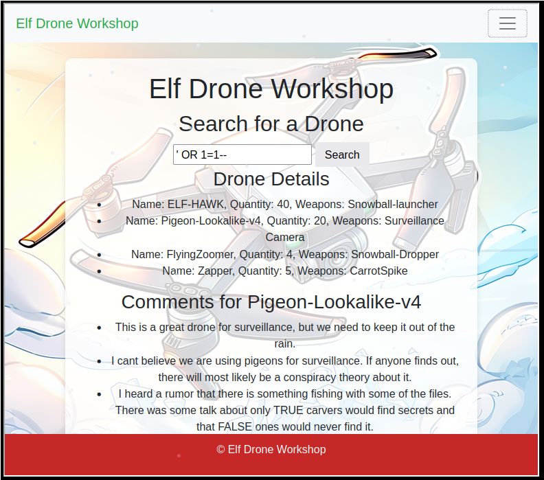

Four drones are shown in the output - ELF-HAWK, Pigeon-Lookalike-v4, FlyingZoomer and Zapper. Due to space constraint, not all comments for every drone can be displayed in the frame. However, full comments can be seen in the Network tab output in the browser's developer mode for all drones:

```
{"comments":["These drones will work great to find Alabasters snowball warehouses.\n I have hid the activation code in the dataset <a href='../files/secret/ELF-HAWK-dump.csv'>ELF-HAWK-dump.csv</a>. We need to keep it safe, for now it's under /files/secret.","We need to make sure we have enough of these drones ready for the upcoming operation. \n Well done on hiding the activation code in the dataset.\n If anyone finds it, it will take them a LONG time or forever to carve the data out, preferably the LATTER."],"drone_name":"ELF-HAWK"} 
```

```
{"comments":["This is a great drone for surveillance, but we need to keep it out of the rain.","I cant believe we are using pigeons for surveillance. \n If anyone finds out, there will most likely be a conspiracy theory about it.","I heard a rumor that there is something fishing with some of the files. \nThere was some talk about only TRUE carvers would find secrets and that FALSE ones would never find it."],"drone_name":"Pigeon-Lookalike-v4"} 
```

```
{"comments":["This drone is perfect for dropping snowballs on unsuspecting targets."],"drone_name":"FlyingZoomer"} 
```

```
{"comments":["This is sort of primitive, but it works!"],"drone_name":"Zapper"}
```

The comments for ELF-HAWK point to a file stored at `/files/secret/ELF-HAWK-dump.csv`. This file can be downloaded and examined in any spreadsheet application. Note that there is a missing newline in the header row of the csv file which needs to be fixed before it can be opened correctly.

There is also a hint that suggests finding the code in the LATitude and LONGitude data, which is useful for the **SILVER AWARD**:

> We need to make sure we have enough of these drones ready for the upcoming operation. Well done on hiding the activation code in the dataset. If anyone finds it, it will take them a LONG time or forever to carve the data out, preferably the LATTER.

This hint refers to the `OSD.longitude` and `OSD.latitude` columns in `ELF-HAWK-dump.csv`. It should be noted that longitude values should range from -180 to 180 degrees, but there are many values in the `OSD.longitude` column that are greater than 180, suggesting that the data should be plotted on a surface without any wraparound. A [short Python script](files/Act2/plot-elf-hawk.py) using the matplotlib module can be used to plot this data:

```
import pandas as pd
from matplotlib import pyplot as plt

elfhawkdata = pd.read_csv("ELF-HAWK-dump-latlong.csv")
plt.plot( elfhawkdata.longitude,elfhawkdata.latitude)
plt.show()
```

The two columns has been extracted, their headers renamed and saved to a file named [`ELF-HAWK-dump-latlong.csv`](files/Act2/ELF-HAWK-dump-latlong.csv) prior to running this script. The generated plot traces out the code "**DroneDataAnalystExpertMedal**", which when entered into the text field in the Admin Console, claims the **SILVER AWARD** for this challenge.

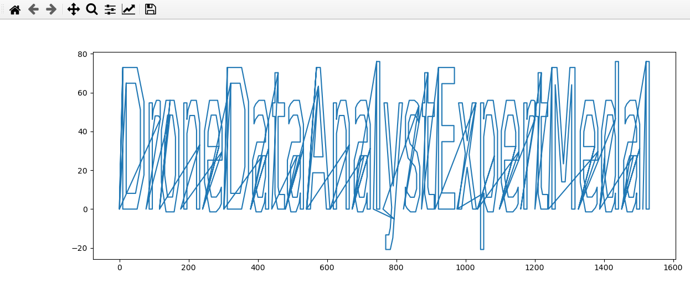

**FOR GOLD AWARD**, refer to the hint from the comments for the drone Pigeon-Lookalike-v4.

> I heard a rumor that there is something fishing with some of the files. There was some talk about only TRUE carvers would find secrets and that FALSE ones would never find it.

"Carving" is a term in computer forensics to refer to the reassembly of files from raw data fragments. The hint suggests that the TRUE and FALSE values in certain columns in `ELF-HAWK-dump.csv` may lead to the next code.

There is a total of 58 columns in `ELF-HAWK-dump.csv` that consists exclusively of TRUE/FALSE strings. To reveal the code for Gold, these need to be converted to binary values (TRUE for 1 and FALSE for 0). This can be done using a spreadsheet application and the [CyberChef](https://gchq.github.io/CyberChef/) tool. Libreoffice is used here but any good spreadsheet should work too. First it is necessary to delete the columns that do not have TRUE/FALSE strings.

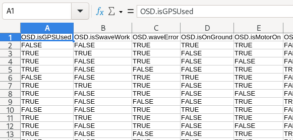

Then, create 58 new columns immediately to the right of this table and use a formula to populate the new cells with "1" and "0" strings according to TRUE/FALSE values in the corresponding cells. Do this for all 3273 rows of data.

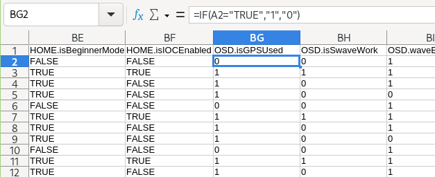

In a new column to the right, use another formula to concatenate the "1" and "0" strings for all rows.

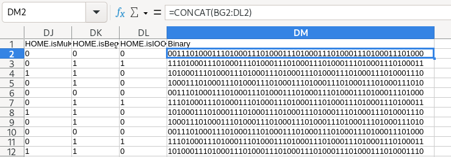

Next, copy out and save this column of ones and zeros into a new csv file, excluding the header. In CyberChef, select the "From Binary" recipe and upload this csv file. The binary data decodes to ASCII characters which form ASCII art. The codeword can be seen near the end of the output.

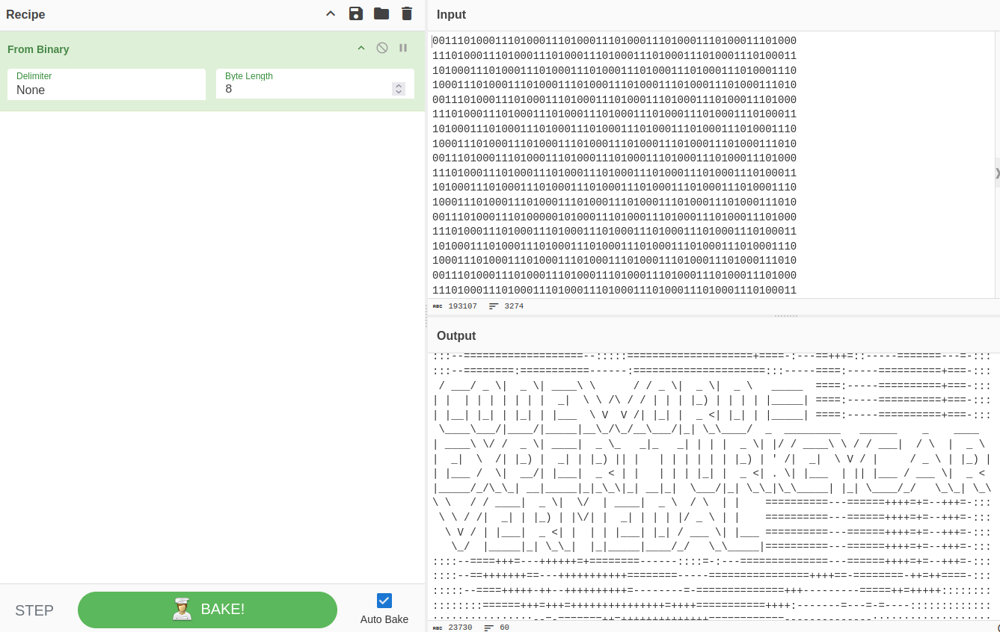

Finally, enter **EXPERTTURKEYCARVERMEDAL** in the Admin Console to claim the **GOLD AWARD**.

### A different approach

The file `Preparations-drone-name.csv` has not been used in the write-up for Gold and Silver here. It is in fact the clue for one of the drone's name. This file can be imported into [Google MyMaps](https://www.google.com/mymaps) and then opened in Google Earth. There is a total of 8 points which when zoomed in and examined in sequence in Google Earth, reveal surface features that resemble the characters that spell out the name "ELF-HAWK".

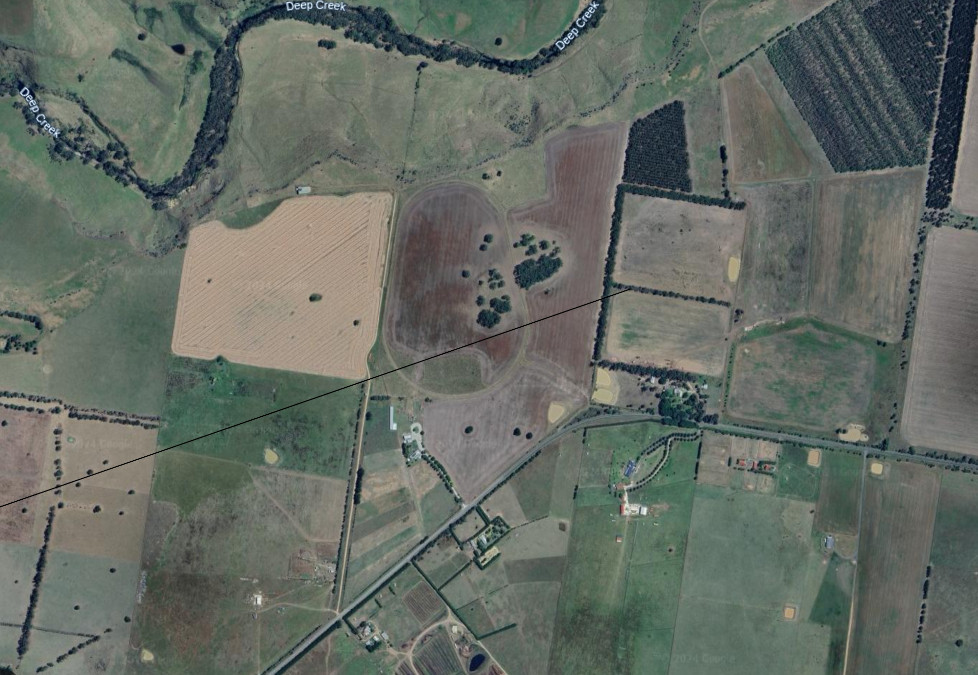

The player can then enter "ELF-HAWK" as the drone name in the Workshop to obtain `ELF-HAWK-dump.csv` and the clue for Silver. Once the codeword for Silver is obtained, a hint about an "injection" vulnerability will be dropped, and the player can go on to discover the other drone names and comments from the Workshop, eventually leading to the Gold codeword.


## Powershell

In this challenge, the player is required to run powershell commands to achieve certain objectives.

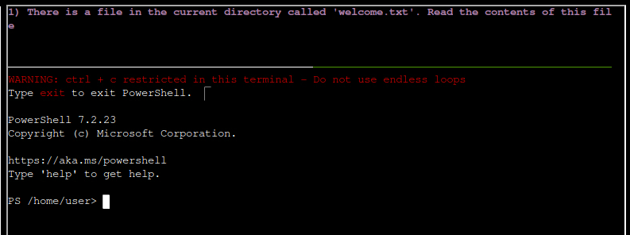

**FOR SILVER AWARD**, there are 11 questions. Here are possible answers.

1. There is a file in the current directory called 'welcome.txt'. Read the contents of this file.
   - `type welcome.txt`
   - `type` is an alias for the Powershell command `Get-Content`.
2. Geez that sounds ominous, I'm sure we can get past the defense mechanisms. We should warm up our PowerShell skills. How many words are there in the file?
   - `Get-Content ./welcome.txt | Measure-Object -Word`
3. There is a server listening for incoming connections on this machine, that must be the weapons terminal. What port is it listening on?
   - `netstat -a`
   - The server is listening on port 1225.
4. You should enumerate that webserver. Communicate with the server using HTTP, what status code do you get?
   - `Invoke-WebRequest -Uri "http://127.0.0.1:1225"`
5. It looks like defensive measures are in place, it is protected by basic authentication. Try authenticating with a standard admin username and password.
   - `$username = "admin"; $password = "admin"; $securePassword = ConvertTo-SecureString -String $password -AsPlainText; $credential = [PSCredential]::new($username, $securePassword) ; Invoke-WebRequest -Uri "http://127.0.0.1:1225" -Authentication Basic -Credential $credential -AllowUnencryptedAuthentication`
   - The username and password are both `admin`. For subsequent invocation of `Invoke-WebRequest`, the same variable `$credential` will be used.
6. There are too many endpoints here. Use a loop to download the contents of each page. What page has 138 words? When you find it, communicate with the URL and print the contents to the terminal.
   - `$response = Invoke-WebRequest -Uri "http://127.0.0.1:1225" -Authentication Basic -Credential $credential -AllowUnencryptedAuthentication; foreach ($endpt in $response.Links) {$r = Invoke-WebRequest -Uri $endpt.href; $ct = $r.Content | Measure-Object -Word; if ($ct.Words -eq 138) {$endpt.href}  }`
   - The above command iterates over all endpoints, queries them, compute the wordcount and output the URL when the word count is 138. The endpoint hosting a page with 138 words is `http://localhost:1225/endpoints/13`.
   - `$resp = Invoke-WebRequest -Uri "http://127.0.0.1:1225/endpoints/13"; $resp.Content`
   - This prints the content to the screen.
7. There seems to be a csv file in the comments of that page. That could be valuable, read the contents of that csv-file!
   - `$resp = Invoke-WebRequest -Uri "http://127.0.0.1:1225/token_overview.csv" -Authentication Basic -Credential $credential -AllowUnencryptedAuthentication ; $resp.Content`
8. Luckily the defense mechanisms were faulty! There seems to be one api-endpoint that still isn't redacted! Communicate with that endpoint!
   - `Invoke-WebRequest -Uri "http://127.0.0.1:1225/tokens/4216B4FAF4391EE4D3E0EC53A372B2F24876ED5D124FE08E227F84D687A7E06C" -Authentication Basic -Credential $credential -AllowUnencryptedAuthentication`
9. It looks like it requires a cookie token, set the cookie and try again.
   - `$resp = Invoke-WebRequest -Uri "http://127.0.0.1:1225/tokens/4216B4FAF4391EE4D3E0EC53A372B2F24876ED5D124FE08E227F84D687A7E06C" -Authentication Basic -Credential $credential -AllowUnencryptedAuthentication -Headers @{Cookie="token=5f8dd236f862f4507835b0e418907ffc"}; $resp.Content`
10. Sweet we got a MFA token! We might be able to get access to the system. Validate that token at the endpoint!
	- `$r = Invoke-WebRequest -Uri "http://127.0.0.1:1225/tokens/4216B4FAF4391EE4D3E0EC53A372B2F24876ED5D124FE08E227F84D687A7E06C" -Authentication Basic -Credential $credential -AllowUnencryptedAuthentication -Headers @{Cookie="token=5f8dd236f862f4507835b0e418907ffc"} ; $mfatokenvalue  = $r.Links | Where-Object href -like "*.*" | select -last 1 -expand href; $mfatokenvalue; $allcookies = "token=5f8dd236f862f4507835b0e418907ffc" + ";mfa_token=" + $mfatokenvalue; $allcookies; $r2 = Invoke-WebRequest -Uri "http://127.0.0.1:1225/mfa_validate/4216B4FAF4391EE4D3E0EC53A372B2F24876ED5D124FE08E227F84D687A7E06C" -Authentication Basic -Credential $credential -AllowUnencryptedAuthentication -Headers @{Cookie=$allcookies}; $r2.Content`
	- The MFA token has an expiry time of 2 seconds and need to be supplied to the `mfa_validate` endpoint almost immediately after it is provided. There is a base64 encoded string in the output.
11. That looks like base64! Decode it so we can get the final secret!
	- `$r = Invoke-WebRequest -Uri "http://127.0.0.1:1225/tokens/4216B4FAF4391EE4D3E0EC53A372B2F24876ED5D124FE08E227F84D687A7E06C" -Authentication Basic -Credential $credential -AllowUnencryptedAuthentication -Headers @{Cookie="token=5f8dd236f862f4507835b0e418907ffc"} ; $mfatokenvalue  = $r.Links | Where-Object href -like "*.*" | select -last 1 -expand href; $mfatokenvalue; $allcookies = "token=5f8dd236f862f4507835b0e418907ffc" + ";mfa_token=" + $mfatokenvalue; $allcookies; $r2 = Invoke-WebRequest -Uri "http://127.0.0.1:1225/mfa_validate/4216B4FAF4391EE4D3E0EC53A372B2F24876ED5D124FE08E227F84D687A7E06C" -Authentication Basic -Credential $credential -AllowUnencryptedAuthentication -Headers @{Cookie=$allcookies}; $r2.Content -match "p>(?<encodedstring>.*)</p"; $encoded = $Matches.encodedstring; [System.Text.Encoding]::ASCII.GetString([System.Convert]::FromBase64String($encoded))`
	- The decoded string reads "Correct Token supplied, you are granted access to the snow cannon terminal. Here is your personal password for access: SnowLeopard2ReadyForAction".

There are two hints for **GOLD AWARD**:

> They also mentioned this lazy elf who programmed the security settings in the weapons terminal. He created a fakeout protocol that he dubbed Elf Detection and Response "EDR". The whole system is literally that you set a threshold and after that many attempts, the response is passed through... I can't believe it. He supposedly implemented it wrong so the threshold cookie is highly likely shared between endpoints! 

> I overheard some of the other elves talking. Even though the endpoints have been redacted, they are still operational. This means that you can probably elevate your access by communicating with them. I suggest working out the hashing scheme to reproduce the redacted endpoints. Luckily one of them is still active and can be tested against. Try hashing the token with SHA256 and see if you can reliably reproduce the endpoint. This might help, pipe the tokens to Get-FileHash -Algorithm SHA256.

The **GOLD** challenge requires the player to set a certain cookie on one of the redacted endpoints. The second clue suggests that the redacted endpoint is obtained by hashing the token string using SHA256. Since one endpoint is unredacted (the same one from the Silver challenge), we can try this idea on the token `5f8dd236f862f4507835b0e418907ffc` and see if it produces the endpoint. Hashing can be done on the Linux command line:

```
$ echo "5f8dd236f862f4507835b0e418907ffc" | sha256sum
4216b4faf4391ee4d3e0ec53a372b2f24876ed5d124fe08e227f84d687a7e06c  -
$ echo -n "5f8dd236f862f4507835b0e418907ffc" | sha256sum
7fa1dad4145bc91c5354c72e540a2903e7933958914a15244e1d5af4ba005172  -
```

The output above demonstrates that a newline character needs to be added to the token string before hashing (the `-n` switch omits the newline at the end). Also, the hex representation of the SHA256 hash is converted to uppercase before it is used in the URL, i.e. "`421B4...A7E06C`" instead of "`4216b4...a7e06c`".

This is a part of the content of `token_overview.csv` file obtained earlier.

```
...
cb722d0b55805cd6feffc22a9f68177d,REDACTED 
724d494386f8ef9141da991926b14f9b,REDACTED 
67c7aef0d5d3e97ad2488babd2f4c749,REDACTED 
5f8dd236f862f4507835b0e418907ffc,4216B4FAF4391EE4D3E0EC53A372B2F24876ED5D124FE08E227F84D687A7E06C 
# [*] SYSTEMLOG 
# [*] Defence mechanisms activated, REDACTING endpoints, starting with sensitive endpoints 
# [-] ERROR, memory corruption, not all endpoints have been REDACTED 
# [*] Verification endpoint still active 
# [*] http://127.0.0.1:1225/tokens/<sha256sum> 
# [*] Contact system administrator to unlock panic mode 
# [*] Site functionality at minimum to keep weapons active 
```

As an example when the token "`67c7aef0d5d3e97ad2488babd2f4c749`" is SHA256-hashed with a newline, the result is "`BAC2F3580B6491CBF26C84F5DCF343D3F48557833C79CF3EFB09F04BE0E31B60`". Hence the URL to access is `http://127.0.0.1:1225/tokens/BAC2F3580B6491CBF26C84F5DCF343D3F48557833C79CF3EFB09F04BE0E31B60`.

When this endpoint is accessed using this command below, the response warns about a fakeout threshold and token validity timeout.

```
$tokenstring = "67c7aef0d5d3e97ad2488babd2f4c749"; 
$endpthash = "BAC2F3580B6491CBF26C84F5DCF343D3F48557833C79CF3EFB09F04BE0E31B60"; 
$URL = "http://127.0.0.1:1225/tokens/" + $endpthash; $cookiestring = "token=" + $tokenstring; 
$cookiestring; 
$r1 = Invoke-WebRequest -Uri $URL -Authentication Basic -Credential $credential -AllowUnencryptedAuthentication -Headers @{Cookie=$cookiestring} ; 
$r1.RawContent
```

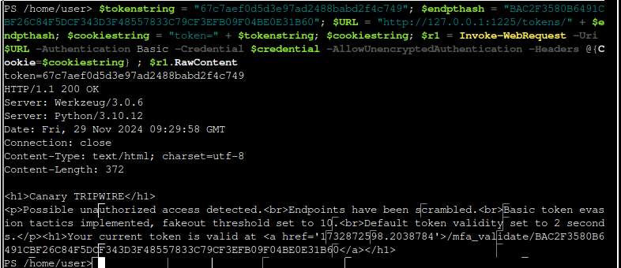

This command can be extended to access the `mfa_validate` endpoint and include the `mfa_token` cookie, as before. The response has a `Set-Cookie` header which contains the `attempts` and `Path` cookies. The value of the `attempts` cookie is set to `c25ha2VvaWwK01`, which is the string "snakeoil" in base64 encoded form.

```
$tokenstring = "67c7aef0d5d3e97ad2488babd2f4c749"; 
$endpthash = "BAC2F3580B6491CBF26C84F5DCF343D3F48557833C79CF3EFB09F04BE0E31B60"; 
$URL = "http://127.0.0.1:1225/tokens/" + $endpthash; 
$cookiestring = "token=" + $tokenstring; 
$cookiestring; 
$r1 = Invoke-WebRequest -Uri $URL -Authentication Basic -Credential $credential -AllowUnencryptedAuthentication -Headers @{Cookie=$cookiestring} ;
$URL2 = "http://127.0.0.1:1225/mfa_validate/" + $endpthash; 
$mfatokenvalue  = $r1.Links | Where-Object href -like "*.*" | select -last 1 -expand href; 
$mfatokenvalue; 
$cookiestring2 = "token=" + $tokenstring + ";
mfa_token=" + $mfatokenvalue; 
for ($j=0; $j -le 10; $j++) {
$r2 = Invoke-WebRequest -Uri $URL2 -Authentication Basic -Credential $credential -AllowUnencryptedAuthentication -Headers @{Cookie=$cookiestring2}; 
$r2.RawContent }
```

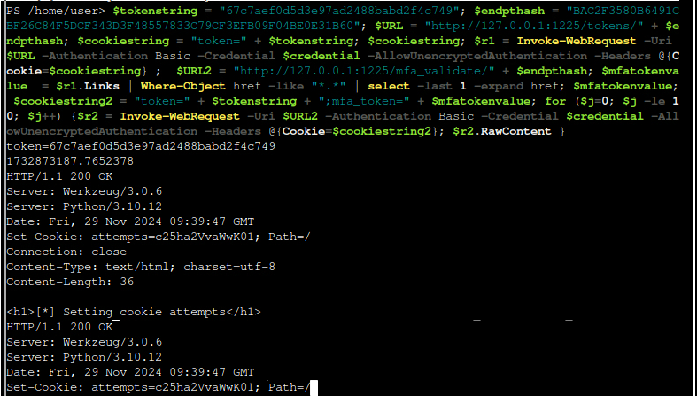

The `Set-Cookie` header used to send cookies from the server to the client, with the expectation that the client can send it back in response later.  The previous command can be slightly modified to include the `attempts` and `Path` cookies.

```
$tokenstring = "67c7aef0d5d3e97ad2488babd2f4c749"; 
$endpthash = "BAC2F3580B6491CBF26C84F5DCF343D3F48557833C79CF3EFB09F04BE0E31B60"; 
$URL = "http://127.0.0.1:1225/tokens/" + $endpthash; $cookiestring = "token=" + $tokenstring; 
$cookiestring; 
$r1 = Invoke-WebRequest -Uri $URL -Authentication Basic -Credential $credential -AllowUnencryptedAuthentication -Headers @{Cookie=$cookiestring} ;
$URL2 = "http://127.0.0.1:1225/mfa_validate/" + $endpthash; $mfatokenvalue  = $r1.Links | Where-Object href -like "*.*" | select -last 1 -expand href; 
$mfatokenvalue; 
$cookiestring2 = "token=" + $tokenstring + ";mfa_token=" + $mfatokenvalue + ";attempts=10; Path=/" ; 
for ($j=0; $j -le 10; $j++) {
$r2 = Invoke-WebRequest -Uri $URL2 -Authentication Basic -Credential $credential -AllowUnencryptedAuthentication -Headers @{Cookie=$cookiestring2}; 
$r2.RawContent }
```

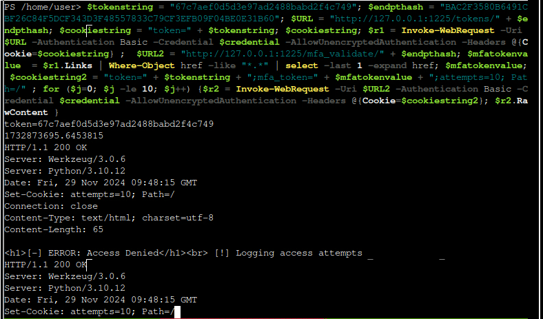

This changes the value of the `attempts` cookie and it completes the **GOLD** challenge.


## Snowball Showdown

This is a game where the player plays against Wombley in a snowball fight. In order to complete the challenge, the player needs to be joined by a second player (Random Match Making). There is also a single player mode (Create Private Room option) where the player can practice throwing snowballs and test out any code modifications, but the game is not scored or timed.

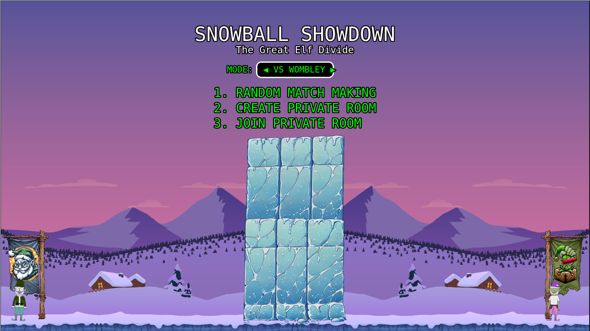

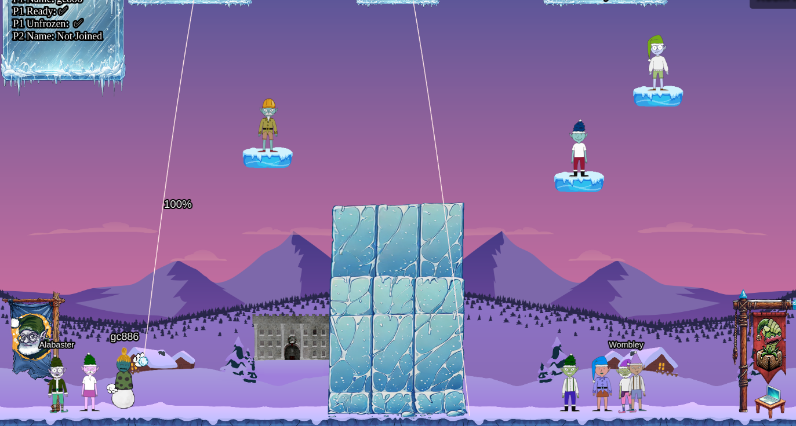

There is a **BRONZE AWARD** for this game, which only requires the player to win in a game against Wombley without any modification of client-side code.

**FOR SILVER AWARD**, the player needs to cheat and win in a game. The conversation with Dusty Giftwrap hints at the tweaking of client-side code:

> Take down Wombley the usual way with a friend, or try a different strategy by tweaking client-side values for an extra edge.
> 
> Alternatively, we've got a secret weapon - a giant snow bomb - but we can't remember where we put it or how to launch it.
>
> Adjust the right elements and victory for Alabaster can be secured with more subtlety. Intriguing, right?

> Christmas is on the line! For a mischievous edge-up, dive into the game’s code - a few client-side tweaks to speed, movement, or power might shift the balance... or just help us find that secret weapon we misplaced!

During gameplay, the following script files (or files containing scripts) are loaded. These can be viewed and downloaded in Chrome browser's developer mode:

- `game.html`
- `elfIds.js`
- `phaser.min.js`
- `reconnecting-websocket.min.js`
- `phaser-snowball-game.js`

There are many ways to tweak client-side code so that the player has an advantage. The approach described here may not cover all of them. The parameters of interest can be found in `phaser-snowball-game.js`, near the start of the file.

```
class SnowBallGame extends Phaser.Scene {
    constructor() {
        super({ key: "game" });
        this.hasBgDebug = typeof window.bgDebug !== 'undefined'
        this.groundOffset = groundOffset;
        this.yellowTint = 0xffeb99;
        this.blueTint = 0x99ddff;
        this.snowballLiveTime = 12000;
        this.healingTerrain = true;
        this.terrainHealDelay = 15000;
        this.elfGroundOffset = GAME_HEIGHT - 115;
        this.wombleyXLocation = GAME_WIDTH - 40;
        this.alabasterXLocation = 40;
        this.playerMoveSpeed = 150;
        this.lastTimePlayerArrowsFromUpdate = 0
        this.lastTimePlayerArrowsFromUpdateDelay = 20
        this.percentageShotPower = 0;
        this.alabasterElvesThrowDelayMin = 1500;
        this.alabasterElvesThrowDelayMax = 2500;
        this.wombleyElvesThrowDelayMin = 1500;
        this.wombleyElvesThrowDelayMax = 2500;
        this.wombleyElvesIncompacitateTime = 5000;
        this.alabasterElvesIncompacitateTime = 5000;
        this.playerIncompacitateTime = 5000;
        this.throwSpeed = 1000;
        this.throwRateOfFire = 1000;
        this.lastThrowTime = 0;
        this.mouseIsOverCanvas = false;
        this.lastPointerPosition = { x: 0, y: 0 };
        this.tempMatrix = new Phaser.GameObjects.Components.TransformMatrix();
		...
```

The variable `this.playerMoveSpeed` can be found in a few lines later in the same script file. It is used in statements similar to the line here.

```
let futurePosOffset = -(this.playerMoveSpeed * (delta / 1000));
```

It appears to determine the player's offset at each update. The larger the value of `this.playerMoveSpeed`, the larger the magnitude of offset. Hence a LARGER value of `this.playerMoveSpeed` would enable the player to move FASTER.

Another variable `this.throwRateOfFire` appears to be related to the rate at which snowballs can be thrown by the player. It is used once in the `calcSnowballTrajectory()` function in the script:

```
// Check if the percentage shot power is zero or if the throw rate limit
 is exceeded
if ((this.percentageShotPower <= 0 || this.lastThrowTime + this.throwRateOfFire > this.time.now) && !archonly) {
```

As suggested in the comment, one intention of this conditional statement is to check if the throw rate limit is exceeded, i.e. the player should not be able to throw another snowball too soon after the previous one was thrown. This condition will be satisfied when `this.lastThrowTime + this.throwRateOfFire > this.time.now` evaluates to true. It works by comparing the time of last throw with the current time, and if the time difference is smaller than `this.throwRateOfFire`, then the condition evaluates to false. Hence, to enable the player to throw snowballs in quicker succession, `this.throwRateOfFire` should be set to a SMALLER value.

There are various other interesting variables such as `this.alabasterElvesThrowDelayMin`, `this.alabasterElvesThrowDelayMax`, `this.alabasterElvesIncompacitateTime` and `this.playerIncompacitateTime` etc, but they are either not used at all in the code or commented out.

Using the "Override content" function in the Sources tab in Chrome, the player can maintain a local modified copy of `phaser-snowball-game.js`. **FOR SILVER AWARD**, the player can try to play and win a game with `this.playerMoveSpeed` and `this.throwRateOfFire` modified to the following values, for example:

- `this.playerMoveSpeed = 600;`
- `this.throwRateOfFire = 5;`

**FOR GOLD AWARD**, the player needs to launch a secret weapon. The code for this weapon is found in the script `reconnecting-websocket.min.js`.

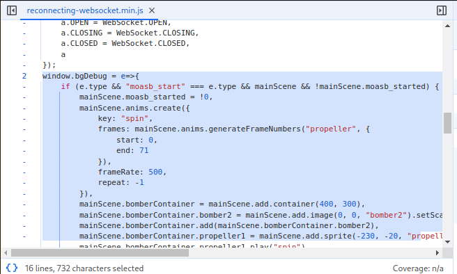

The function `window.bgDebug` takes an argument `e` which appears to be a Javascript *object* (key-value pair) since it has a property `type` which is checked at the start of the function. The code with the `if` block has some mention of a "bomb", so this is likely to be the secret weapon. One of the conditions for the `if` statement to evaluate to true is for the value `e.type` to be equal to the string "`moasb_start`".

To trigger the secret weapon, the player can start the game, go into the browser's developer mode and run the following statements in the Console tab:

```
var foo = { type: "moasb_start" }; window.bgDebug(foo)
```

This creates a new object `foo`, assigns the string `moasb_start` to `foo.type` and runs the function `window.bgDebug` with this object as the argument.

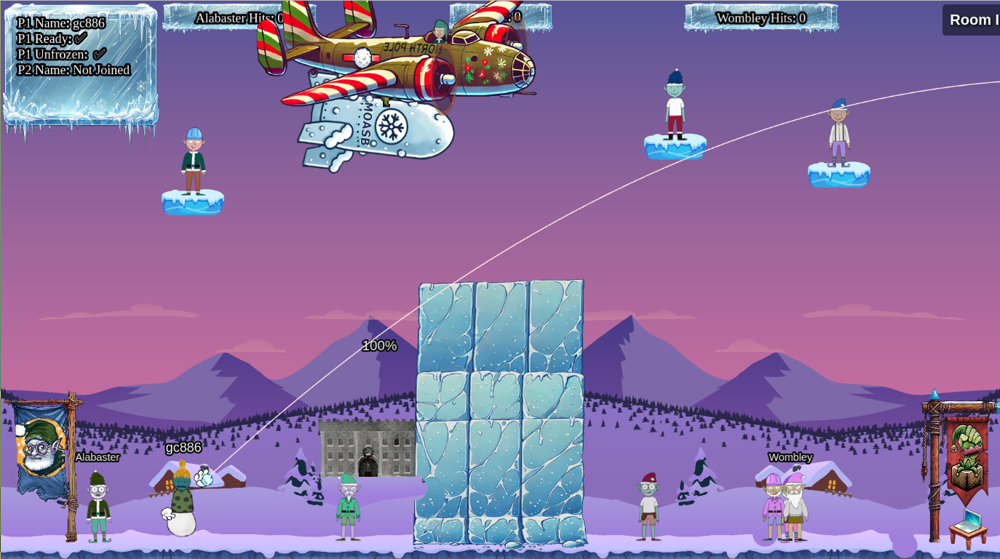

Triggering this secret weapon in single or multiplayer modes will claim the player the **GOLD AWARD**.

## Microsoft KC7

There are four sections to this challenge which revolves around using Kusto Query Language (KQL) to analyse logs from a malware incident. Completion of 2 sections gives the player a **SILVER AWARD** while completing 4 gives **GOLD**. The challenge can be accessed at <http://kc7cyber.com/go/hhc24>.


