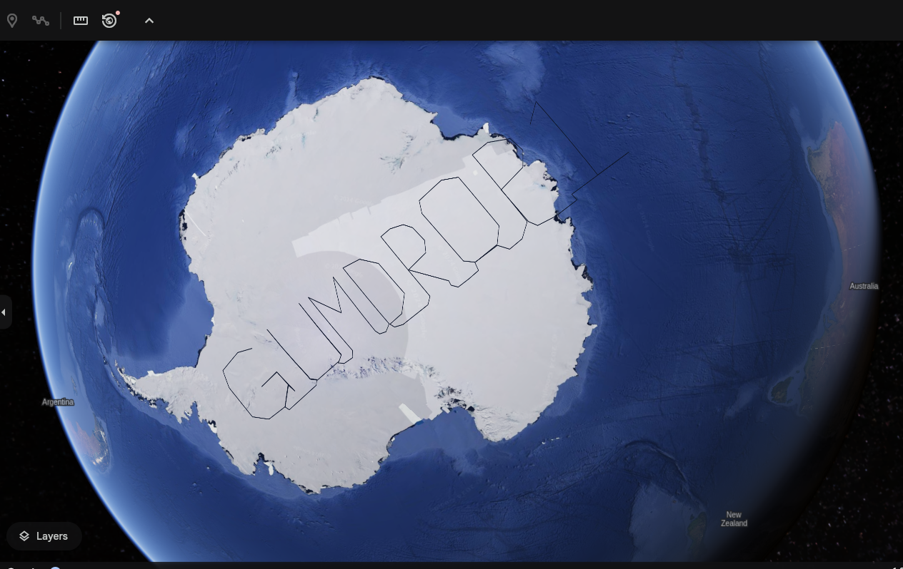

# Act 2

Act 2 consists of 5 challenges.

## Mobile Analysis

For this challenge, it is best to decompile the apk/aab into Java code for better readability. This can be done using the tool `jadx`. The missing name can found by inspecting the Java code for each version of the app. The objective is to find excluded names from Santa's lists.

**FOR SILVER AWARD**, first run `jadx SantaSwipe.apk` to decompile the apk. Ignore the errors. The files will be stored in a newly created directory named `SantaSwipe`. The two files are interest are in the `SantaSwipe/sources/com/northpole/santaswipe` directory, namely `DatabaseHelper.java` and `MainActivity.java`.

Many SQL statements are run in `DatabaseHelper.java`. Three tables are created - `NiceList`, `NaughtyList` and `NormalList`. Then names are inserted into the `NormalList` table.

```
        db.execSQL("CREATE TABLE IF NOT EXISTS NiceList (Item TEXT);");
        db.execSQL("CREATE TABLE IF NOT EXISTS NaughtyList (Item TEXT);");
        db.execSQL("CREATE TABLE IF NOT EXISTS NormalList (Item TEXT);");
        db.execSQL("DELETE FROM NiceList;");
        db.execSQL("DELETE FROM NaughtyList;");
        db.execSQL("DELETE FROM NormalList;");
        db.execSQL("INSERT INTO NormalList (Item) VALUES ('Carlos, Madrid, Spain');");
        db.execSQL("INSERT INTO NormalList (Item) VALUES ('Aiko, Tokyo, Japan');");
        db.execSQL("INSERT INTO NormalList (Item) VALUES ('Maria, Rio de Janeiro, Brazil');");
        db.execSQL("INSERT INTO NormalList (Item) VALUES ('Liam, Dublin, Ireland');");

```

It is in `MainActivity.java` where a name seems to be excluded. This statement is from line 127. 

```
                Cursor cursor = sQLiteDatabase.rawQuery("SELECT Item FROM NormalList WHERE Item NOT LIKE '%Ellie%'", null);
                List items = new ArrayList();

```

The name **Ellie** is excluded from the result of this SQL statement.

Similarly, for **GOLD AWARD**, the missing name needs to be identified from the release version of the app `SantaSwipeSecure.aab`. Run `jadx SantaSwipeSecure.aab` to decompile and find the Java files in the directory `SantaSwipeSecure/sources/com/northpole/santaswipe`.

It can be seen from `DatabaseHelper.java` that some strings are obfuscated.

```
    private final void insertInitialData(SQLiteDatabase db) {
        String[] strArr = new String[270];
        strArr[R.xml.backup_rules] = "L2HD1a45w7EtSN41J7kx/hRgPwR8lDBg9qUicgz1qhRgSg==";
        strArr[R.xml.data_extraction_rules] = "IWna1u1qu/4LUNVrbpd8riZ+w9oZNN1sPRS2ujQpMqAAt114Yw==";
        strArr[R.styleable.FontFamily] = "MWfO0+M1t5IvQtN2ad9w3hp81sYQIIaX6veq03bnk6I4H/1n89gW";
```

These strings are then inserted into SQL statements in obfuscated form, as seen in lines 342-345.

```
        Iterator it = CollectionsKt.listOf((Object[]) strArr).iterator();
        while (it.hasNext()) {
            db.execSQL("INSERT INTO NormalList (Item) VALUES ('" + StringsKt.trim((CharSequence) it.next()).toString() + "');");
         }
```

These statements are for the insertion of names. The statement for excluding a name is likely elsewhere.

There is a long SQL statement near the top of the same file. The function `decryptData` decrypts this statement (base64 encoded ciphertext) before it is executed.

```
        db.execSQL(decryptData("IVrt+9Zct4oUePZeQqFwyhBix8cSCIxtsa+lJZkMNpNFBgoHeJlwp73l2oyEh1Y6AfqnfH7gcU9Yfov6u70cUA2/OwcxVt7Ubdn0UD2kImNsclEQ9M8PpnevBX3mXlW2QnH8+Q+SC7JaMUc9CIvxB2HYQG2JujQf6skpVaPAKGxfLqDj+2UyTAVLoeUlQjc18swZVtTQO7Zwe6sTCYlrw7GpFXCAuI6Ex29gfeVIeB7pK7M4kZGy3OIaFxfTdevCoTMwkoPvJuRupA6ybp36vmLLMXaAWsrDHRUbKfE6UKvGoC9d5vqmKeIO9elASuagxjBJ"));
```

The `decryptData` function can be found near the end of this code.

```
    private final String decryptData(String encryptedData) {
        try {
            Cipher cipher = Cipher.getInstance("AES/GCM/NoPadding");
            cipher.init(R.styleable.FontFamily, this.secretKeySpec, new GCMParameterSpec(128, this.iv));
            byte[] doFinal = cipher.doFinal(Base64.decode(encryptedData, R.xml.backup_rules));
            Intrinsics.checkNotNull(doFinal);
            return new String(doFinal, Charsets.UTF_8);
        } catch (Exception e) {
            Log.e("DatabaseHelper", "Decryption failed: " + e.getMessage());
            return null;
        }
    }
```

A few things can be inferred from this function. **AES in GCM mode** is used for decryption (and therefore encryption of the original data). The IV (initialization vector) is `this.iv` and the encryption key is `this.secretKeySpec`.

These definitions can be found near the beginning of the code.

```
public final class DatabaseHelper extends SQLiteOpenHelper {
    private static final String DATABASE_NAME = "naughtynicelist.db";
    private static final int DATABASE_VERSION = 1;
    private final byte[] encryptionKey;
    private final byte[] iv;
    private final SecretKeySpec secretKeySpec;
    public static final int $stable = 8;

    /* JADX WARN: 'super' call moved to the top of the method (can break code semantics) */
    public DatabaseHelper(Context context) {
        super(context, DATABASE_NAME, (SQLiteDatabase.CursorFactory) null, R.xml.data_extraction_rules);
        Intrinsics.checkNotNullParameter(context, "context");
        String string = context.getString(R.string.ek);
        Intrinsics.checkNotNullExpressionValue(string, "getString(...)");
        String obj = StringsKt.trim((CharSequence) string).toString();
        String string2 = context.getString(R.string.iv);
        Intrinsics.checkNotNullExpressionValue(string2, "getString(...)");
        String obj2 = StringsKt.trim((CharSequence) string2).toString();
        byte[] decode = Base64.decode(obj, R.xml.backup_rules);
        Intrinsics.checkNotNullExpressionValue(decode, "decode(...)");
        this.encryptionKey = decode;
        byte[] decode2 = Base64.decode(obj2, R.xml.backup_rules);
        Intrinsics.checkNotNullExpressionValue(decode2, "decode(...)");
        this.iv = decode2;
        this.secretKeySpec = new SecretKeySpec(decode, "AES");
    }
```

Tracing the definitions backwards, `this.iv` is derived from `decode2`, which is from `obj2`. This is from `string2`, which is originally from **`R.string.iv`**.

Similarly for `this.secretKeySpec`, this is the chain of definitions: `R.string.ek -> string -> obj -> decode -> this.secretKeySpec`. Hence `this.secretKeySpec` is ultimately derived from **`R.string.ek`**.

These definitions can be found in the file `R.java` in the same directory.

```
    public static final class string {
        public static int app_name = 0x7f090001;
        public static int ek = 0x7f090033;
        public static int iv = 0x7f090037;
```

These values are just references (resource IDs) produced during decompilation. The actual values of the encryption key and IV are defined elsewhere.

These resources can be found stored in the `SantaSwipeSecure/resources/res/values/strings.xml` file after some search.

```
    <string name="dropdown_menu">Dropdown menu</string>
    <string name="ek">rmDJ1wJ7ZtKy3lkLs6X9bZ2Jvpt6jL6YWiDsXtgjkXw=</string>
    <string name="expanded">Expanded</string>
    <string name="in_progress">In progress</string>
    <string name="indeterminate">Partially checked</string>
    <string name="iv">Q2hlY2tNYXRlcml4</string>
    <string name="m3c_bottom_sheet_pane_title">Bottom Sheet</string>
```

The values `ek` and `iv` are base64 encoded. These are their values in hex:

```
ek: ae60c9d7027b66d2b2de590bb3a5fd6d9d89be9b7a8cbe985a20ec5ed823917c
iv: 436865636b4d617465726978 (CheckMaterix)
```

Decoding can be done on the linux command line (`echo -n <b64string> | base64 -d | hexdump -C`) or in the [CyberChef](https://gchq.github.io/CyberChef/) tool. 

Going back to the encrypted SQL statement in `DatabaseHelper.java`, the base64 encoded (encrypted) ciphertext string decodes to the following (use From Base64, To Hex in CyberChef):

```
215aedfbd65cb78a1478f65e42a170ca1062c7c712088c6db1afa525990c369345060a07789970a7bde5da8c8487563a01faa77c7ee0714f587e8bfabbbd1c500dbf3b073156ded46dd9f4503da422636c725110f4cf0fa677af057de65e55b64271fcf90f920bb25a31473d088bf10761d8406d89ba341feac92955a3c0286c5f2ea0e3fb65324c054ba1e525423735f2cc1956d4d03bb6707bab1309896bc3b1a9157080b88e84c76f607de548781ee92bb3389191b2dce21a1717d375ebc2a133309283ef26e46ea40eb26e9dfabe62cb3176805acac31d151b29f13a50abc6a02f5de6faa629e20ef5e9404ae6a0c63049
```

Since AES-GCM is an authenticated mode of operation, an authentication tag is usually appended to the end of the ciphertext. The length of this tag is not specified in the code. A tag length of 12 bytes is usually used, but it can be any length up to 16 bytes (AES block size). Since the GCM tag is required for AES GCM mode decryption in CyberChef, it is necessary to try different lengths and see if decryption succeeds. For example, if the GCM tag is 8 bytes long, then the string `e9404ae6a0c63049` (last 8 bytes of the above ciphertext) should be entered into the GCM tag field and DELETED from the ciphertext. The key should be set to `ek` and the IV to `iv`.

After some trials, decryption succeeds with a GCM tag of 16 bytes with the following as the plaintext output:

```
CREATE TRIGGER DeleteIfInsertedSpecificValue
    AFTER INSERT ON NormalList
    FOR EACH ROW
    BEGIN
        DELETE FROM NormalList WHERE Item = 'KGfb0vd4u/4EWMN0bp035hRjjpMiL4NQurjgHIQHNaRaDnIYbKQ9JusGaa1aAkGEVV8=';
    END;
```

This is a deletion statement for the encrypted string `KGfb0vd4u/4EWMN0bp035hRjjpMiL4NQurjgHIQHNaRaDnIYbKQ9JusGaa1aAkGEVV8=` (it is likely to be encrypted since direct base64 decoding yields gibberish). Once again, repeat the decryption process with the same encryption key, same IV and GCM tag (last 16 bytes of this new ciphertext) to obtain the following:

```
Joshua, Birmingham, United Kingdom
```

The name missing from the table `NormalList` is **Joshua**.


## Drone Path

Clicking on the burger menu at the top-right corner of the frame would reveal a menu with three items - Home, FileShare and Login. The Login option brings the player to a login screen that prompts for the username and password. The FileShare page has a link to a file named `fritjolf-Path.kml`.

For visualization, this kml file can be downloaded and then imported into Google Earth. The kml code in the file traces out a path that spells "GUMDROP1"



The filename of the kml file hints at the username for the login screen. Indeed, access can be gained with following credentials:

- Username: **fritjolf**
- Password: **GUMDROP1**

Once logged in, a few more items will show up in the drop down menu - Workshop, Profile and Admin Console. The Profile page provides the link to a csv file `Preparations-drone-name.csv` while the Admin Console has a text field for the submission of a code for drone fleet administration.

The Workshop page has a text field for the entry of drone names. Incidentally, this field is vulnerable to SQL injection. Entering the basic SQL injection string `' OR 1=1--` suffices to reveal entries in the backend database.


Four drones are shown in the output - ELF-HAWK, Pigeon-Lookalike-v4, FlyingZoomer and Zapper. Due to space constraint, not all comments for every drone can be displayed. Full comments can be seen in the Network tab output in the browser's developer mode for all drones:

```
{"comments":["These drones will work great to find Alabasters snowball warehouses.\n I have hid the activation code in the dataset <a href='../files/secret/ELF-HAWK-dump.csv'>ELF-HAWK-dump.csv</a>. We need to keep it safe, for now it's under /files/secret.","We need to make sure we have enough of these drones ready for the upcoming operation. \n Well done on hiding the activation code in the dataset.\n If anyone finds it, it will take them a LONG time or forever to carve the data out, preferably the LATTER."],"drone_name":"ELF-HAWK"} 
```

```
{"comments":["This is a great drone for surveillance, but we need to keep it out of the rain.","I cant believe we are using pigeons for surveillance. \n If anyone finds out, there will most likely be a conspiracy theory about it.","I heard a rumor that there is something fishing with some of the files. \nThere was some talk about only TRUE carvers would find secrets and that FALSE ones would never find it."],"drone_name":"Pigeon-Lookalike-v4"} 
```

```
{"comments":["This drone is perfect for dropping snowballs on unsuspecting targets."],"drone_name":"FlyingZoomer"} 
```

```
{"comments":["This is sort of primitive, but it works!"],"drone_name":"Zapper"}
```

The comments for ELF-HAWK point to a file stored at `/files/secret/ELF-HAWK-dump.csv`. This file can be downloaded and examined in any spreadsheet application. Note that there is a missing newline in the header row of the csv file which needs to be fixed before it can be opened correctly.

There is also a hint that suggests finding the code in the LATitude and LONGitude data, which is useful for the **SILVER AWARD**:

> We need to make sure we have enough of these drones ready for the upcoming operation. Well done on hiding the activation code in the dataset. If anyone finds it, it will take them a LONG time or forever to carve the data out, preferably the LATTER.

This hint points to the `OSD.longitude` and `OSD.latitude` columns in `ELF-HAWK-dump.csv`. It should be noted that longitude values should range from -180 to 180 degrees, but there are many values in the `OSD.longitude` column that are greater than 180, suggesting that the data should be plotted on a surface without any wraparound. A [short Python script](files/Act2/plot-elf-hawk.py) using the matplotlib module can be used to plot this data:

```
import pandas as pd
from matplotlib import pyplot as plt

elfhawkdata = pd.read_csv("ELF-HAWK-dump-latlong.csv")
plt.plot( elfhawkdata.longitude,elfhawkdata.latitude)
plt.show()
```

The two columns has been extracted, their headers renamed and saved to a file named [`ELF-HAWK-dump-latlong.csv`](files/Act2/ELF-HAWK-dump-latlong.csv) prior to running this script. The plot generated traces out the code "**DroneDataAnalystExpertMedal**", which when entered into the text field in the Admin Console, claims the **SILVER AWARD** for this challenge.


**FOR GOLD AWARD**, refer to the hint from the comments for the drone Pigeon-Lookalike-v4.

> I heard a rumor that there is something fishing with some of the files. There was some talk about only TRUE carvers would find secrets and that FALSE ones would never find it.

"Carving" is a term in computer forensics to refer to the reassembly of files from raw data fragments. The hint suggests that the TRUE and FALSE values in certain columns in `ELF-HAWK-dump.csv` may lead to the next code.

There are a total of 58 columns in `ELF-HAWK-dump.csv` that consists exclusively of TRUE/FALSE strings. To reveal the code for Gold, these need to be converted to binary values (TRUE for 1 and FALSE for 0). This can be done using a spreadsheet application and the [CyberChef](https://gchq.github.io/CyberChef/) tool. First it is necessary to delete the columns that do not have TRUE/FALSE strings.


Then, create 58 new columns immediate to the right of this table and use a formula to populate the new cells with "1" and "0" strings according to TRUE/FALSE values in the corresponding cells. Do this for all 3273 rows of data.


In a new column to the right, use another formula to concatenate the "1" and "0" strings for all rows.


Next, copy out and save this column of ones and zeros into a new csv file, excluding the header. In CyberChef, select the "From Binary" recipe and upload this csv file. The binary data decodes to ASCII characters which form ASCII art. The codeword can be seen near the end of the output.


Finally, enter **EXPERTTURKEYCARVERMEDAL** in the Admin Console to claim the **GOLD AWARD**.

### A different approach

The file `Preparations-drone-name.csv` has not been used in the write-up for Gold and Silver here. It is in fact the clue for one of the drone's name. This file can be imported into [Google MyMaps](https://www.google.com/mymaps) and then opened in Google Earth. There is a total of 8 points which when zoomed in and examined in sequence in Google Earth, reveal surface features that resemble the characters that spell out the name "ELF-HAWK".


The player can then enter "ELF-HAWK" as the drone name in the Workshop to obtain `ELF-HAWK-dump.csv` and the clue for Silver. Once the codeword for Silver is obtained, a hint about an "injection" vulnerability will be dropped, and the player can go on to discover the other drone names and comments from the Workshop, eventually leading to the Gold codeword.
