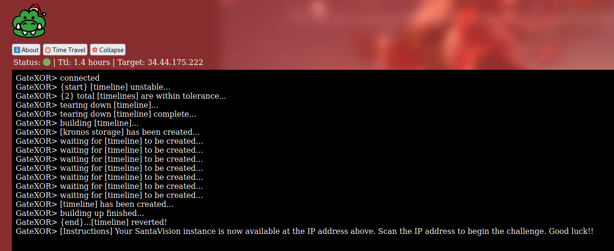
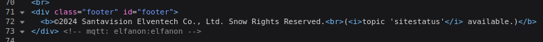
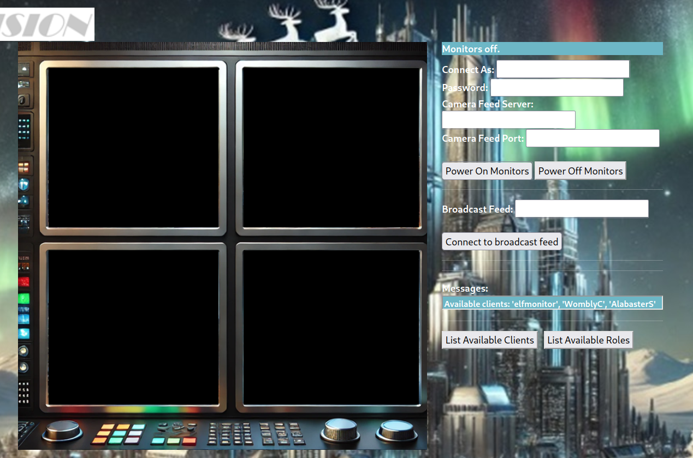
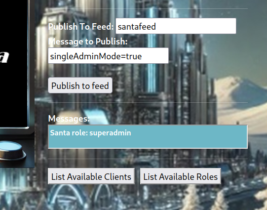
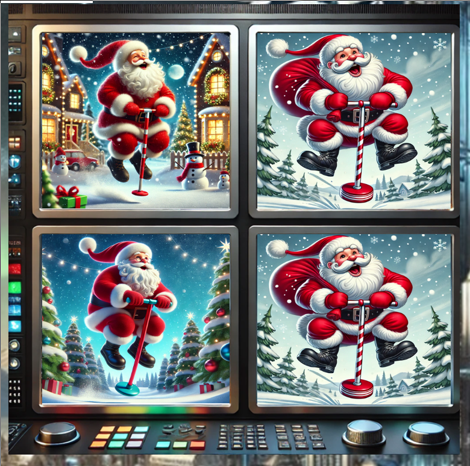
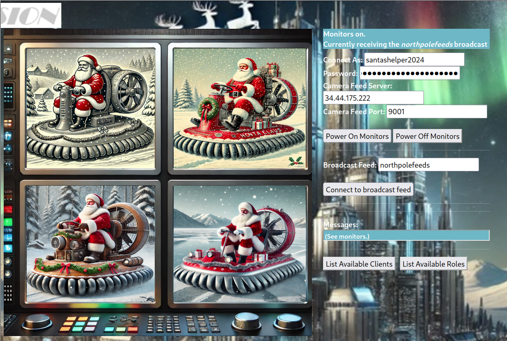

# Act 3 - Santa Vision

Each track in this challenge has four objectives relating to different actions on the Santa Vision web portal:

- A: Log into the Santa Vision portal
- B: Turn on the monitors
- C: Find out the code name for the elves' secret operation
- D: Demote Wombley and Alabaster and check the `northpolefeeds` feed for Santa's image

The Silver and Gold tracks require the achieving of the same four objectives, but in different ways.

In order to spin up the Santa Vision instance, the player has to click on the "Time Travel" button and wait. Once the instance is ready, the IP address (henceforth to be referred to as `<IP address>`) will be shown in the "Target" field. This IP address is not constant and will change between subsequent spin-ups of the challenge instance.



It is necessary to scan the instance for interesting open ports if the player is spinning up the instance for the first times. The result of a basic `nmap` scan (without any options) on the instance's IP address show 3 open ports - 22, 8000 and 9001.

```
Nmap scan report for 222.175.44.34.bc.googleusercontent.com (34.44.175.222)
Host is up (0.21s latency).
Not shown: 997 closed tcp ports (conn-refused)
PORT     STATE SERVICE
22/tcp   open  ssh
8000/tcp open  http-alt
9001/tcp open  tor-orport

Nmap done: 1 IP address (1 host up) scanned in 42.54 seconds
```

Port 8000 hosts the web service and is the entry point for this challenge. It can be accessed with a browser at `http://<IP address>:8000`, which directs the player to a login page.


## Silver track

The starting point for the Silver track is the login page at `http://<IP address>:8000`.

### Silver A

The HTML source for the login page has a line that suggests that the username and password are `elfanon`.



Indeed, this credential work. The answer for Silver A is `elfanon`.

Once logged in, the player will be brought to a different page that shows text boxes and images of monitors.

### Silver B

To turn on the monitors, a username and password need to be provided in the "Connect As" and "Password" fields.



The two buttons "List Available Clients" and "List Available Roles" near the bottom of the page provide hints for the credential. Clicking on each of these buttons show different messages in the text box above:

- "List Available Clients":`Available clients: 'elfmonitor', 'WomblyC', 'AlabasterS'`
- "List Available Roles": `Available roles: 'SiteDefaultPasswordRole', 'SiteElfMonitorRole', 'SiteAlabsterSAdminRole', 'SiteWomblyCAdminRole'`

After some trying, the player would discover that the username and password combination of `elfmonitor` and `SiteElfMonitorRole` turns the monitors on, provided also that the `<IP address>` and port value of 9001 (discovered from the `nmap` scan) are entered in the "Camera Feed Server" and "Camera Feed Port" fields.

The answer for Silver B is `elfmonitor`.

### Silver C

With the monitors powered on, it is possible to connect to feeds. The first of which is `northpolefeeds`, mentioned in the objective description for Silver B. Once `northpolefeeds` is entered into the "Broadcast Feed" field and the player connects by clicking on "Connect to broadcast feed" button, images will show up on the monitors. These are propaganda from the Wombley and Alabaster factions.

The next feed to check is `frostbitfeed`, as mentioned in the objective description for Silver C. Once the player is connected to this feed, the message box cycles through a series of messages, and one of them reads "Additional messages available in santafeed", which points to the next step.

Another set of messages are shown in the message box once the player is connected to `santafeed`. One of them holds the answer to Silver C: "Sixteen elves launched operation: Idemcerybu". 

The answer for Silver C, which is also the code name for the elves' secret operation, is "Idemcerybu".

### Silver D

This part is about demoting Wombley and Alabaster using an MQTT message so that they do not have privileges to post to `northpolefeeds`. There are some other interesting messages in `santafeed`:

- WombleyC role: admin
- singleAdminMode=false
- superAdminMode=true
- Santa role: superadmin
- AlabasterS role: admin

Incidentally, additional text fields appear once the player turns on the monitors using the `elfmonitor` credential. Publishing to feeds seem to be permitted. Since the `santafeed` messages show there are too many admins (Wombley, Alabaster and Santa), it may make sense to enable the `singleAdminMode`, which is set to `false`, as indicated by one of the messages.



Once the message `singleAdminMode=true` is published to the `santafeed` feed, a message "Publish results: Publish attempted. Check monitors." appears in the message box informing the player to check the monitors. Connecting back to `northpolefeeds` at this point would show images of Santa hopping around on the pogo stick.



The answer for Silver D is "Pogo stick".

## Gold track

The starting point for the Gold track is also `http://<IP address>:8000`. However, care has to be take to not mix up the information obtained from the Silver track here.

### Gold A

There is a line at the bottom of the login screen informing the player to check the `sitestatus` feed.


This feed can be viewed in the same way as for the Silver track. Simply log into the portal and turn on the monitors using the `elfanon` and `elfmonitor` credentials, then connect to the `sitestatus` feed.

The most interesting messages in the `sitestatus` feed reads "File downloaded: /static/sv-application-2024-SuperTopSecret-9265193/applicationDefault.bin". This appears to be the path to a file. Indeed, this file `applicationDefault.bin` can be accessed and downloaded at the URL `http://<IP address>:8000/static/sv-application-2024-SuperTopSecret-9265193/applicationDefault.bin`.

The Linux `file` utility identifies this file as a data file that contains the `jffs2` filesystem.

```
$ file applicationDefault.bin 
applicationDefault.bin: Linux jffs2 filesystem data little endian
```

According to the hints from Rib Bonbowford, the tool at <https://github.com/onekey-sec/jefferson/> can be used to extract files from this filesystem. Details regarding the setting up of this tool is not covered here, but it is rather straightforward and best done using a Python virtual environment `venv`. As mentioned on the github page, once the tool is installed, it is but a matter of running the command `jefferson filesystem.img -d outdir`. The extracted files will be available in the directory name `outdir`.

At this stage, the most interesting file can be found at the path `outdir/app/src/accounts/views.py`. There are lines of code that suggest the existence of another interesting file, which could be an `sqlite` database.

```
@accounts_bp.route("/sv2024DB-Santa/SantasTopSecretDB-2024-Z.sqlite", methods=["GET"])
def db():
    return send_from_directory("static", "sv2024DB-Santa/SantasTopSecretDB-2024-Z.sqlite", as_attachment=True)
```

This file can be downloaded at the URL `http://<IP address>:8000/sv2024DB-Santa/SantasTopSecretDB-2024-Z.sqlite`. The Linux `file` utility identifies this as an SQLite database.  

```
$ file SantasTopSecretDB-2024-Z.sqlite 
SantasTopSecretDB-2024-Z.sqlite: SQLite 3.x database, last written using SQLite version 3046000, file counter 16, database pages 5, cookie 0x2, schema 4, UTF-8, version-valid-for 16
```

This database can be viewed using any SQLite 3 viewer. In Linux, the `sqlite3` utility (it is not usually part of the Linux default base system and needs to be installed first) can be used along with some basic SQL statements:  
```
$ sqlite3 SantasTopSecretDB-2024-Z.sqlite  
SQLite version 3.46.0 2024-05-23 13:25:27 
Enter ".help" for usage hints. 
sqlite> .schema 
CREATE TABLE alembic_version ( 
version_num VARCHAR(32) NOT NULL,  
CONSTRAINT alembic_version_pkc PRIMARY KEY (version_num) 
); 
CREATE TABLE users ( 
id INTEGER NOT NULL,  
username VARCHAR NOT NULL,  
password VARCHAR NOT NULL,  
created_on DATETIME NOT NULL,  
is_admin BOOLEAN NOT NULL,  
PRIMARY KEY (id),  
UNIQUE (username) 
);
```

There are two tables in the database: `alembic_version` and `users`. The interesting data can be found in the `users` table:  
```
sqlite> select * from alembic_version 
   ...> ; 
7351a35fa22f 
sqlite> select * from users; 
1|santaSiteAdmin|S4n+4sr3411yC00Lp455wd|2024-01-23 06:05:29.466071|1 
```

This appears to be a second set of credential for the initial login page. Indeed, using `santaSiteAdmin` as the username and `S4n+4sr3411yC00Lp455wd` as the password allows the player to log into the Santa Vision web portal.

The answer for Gold A is `santaSiteAdmin`. 

### Gold B

The hints from Rib Bonbowford mention HTTP headers. After logging in using Gold A credentials, the browser's developer mode can used to examine the HTTP response headers, where the next set of credentials for turning on the monitors can be found.


The username (`santashelper2024`) and password can be found in the `BrkrUser` and `BrkrPswd` headers in the HTTP response. It should be noted that the password is of the form `playerSantaHelperPass<random_number>` and is not the same across instances, i.e. some random number would be appended to the end of the string `playerSantaHelperPass` each time. Except for the use of different username and password, the procedure for turning on the monitors is similar to that described in Silver B.

The answer for Gold B is `santashelper2024`.

### Gold C

The answer to Silver D is in fact the ROT16 encoding of the Gold C answer (vaguely alluded to in the feed message "Sixteen elves..."). To derive the Gold C answer, simply apply ROT10 to the Silver C answer. This can be done on sites such as <https://rot13.com/>. ROT10("Idemcerybu") is "Snowmobile", which is the answer for Gold C.

### Gold D

The procedure to demote the elves is similar to that in Silver D, but with a twist. The message publishing function does not show up when the player is logged in using Gold credentials `santaSiteAdmin` and `santashelper2024`. Publishing fails even when the message publishing function is forced to appear by editing the HTML source.

The player needs to use an MQTT client to perform this action. For Linux, the tool `mosquitto_pub` can be used - it is not part of the standard Linux base system and needs to be installed separately.  
```
$ mosquitto_pub -d -h <IP address> -u santashelper2024 -P playerSantaHelperPass<random_number> -t 'santafeed' -m 'singleAdminMode=true' 
Client null sending CONNECT 
Client null received CONNACK (0) 
Client null sending PUBLISH (d0, q0, r0, m1, 'santafeed', ... (20 bytes)) 
Client null sending DISCONNECT 
```

In the command above, the `<IP address>` and `<random_number>` placeholders should be substituted with appropriate values.

If publishing succeeds, the `northpolefeeds` feed should show images of Santa riding hovercrafts.



The answer for Gold D is "Hovercraft".
