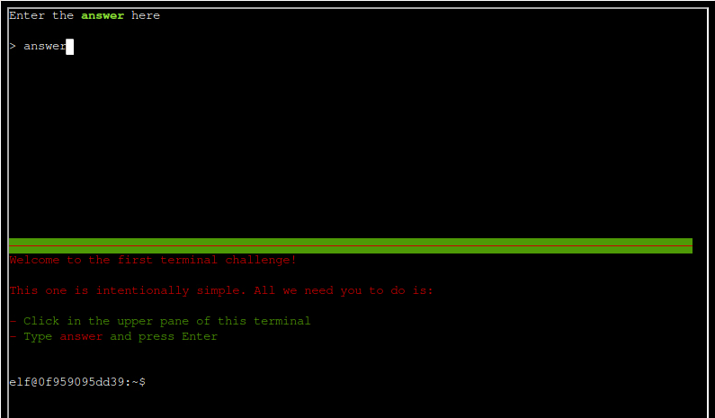
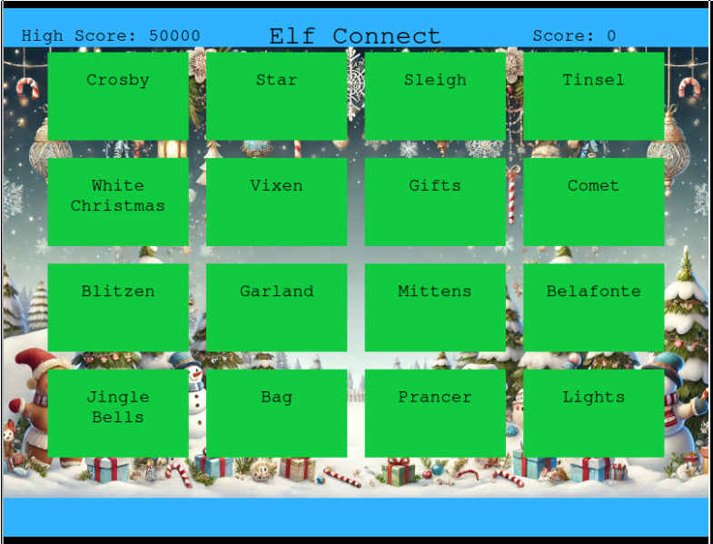
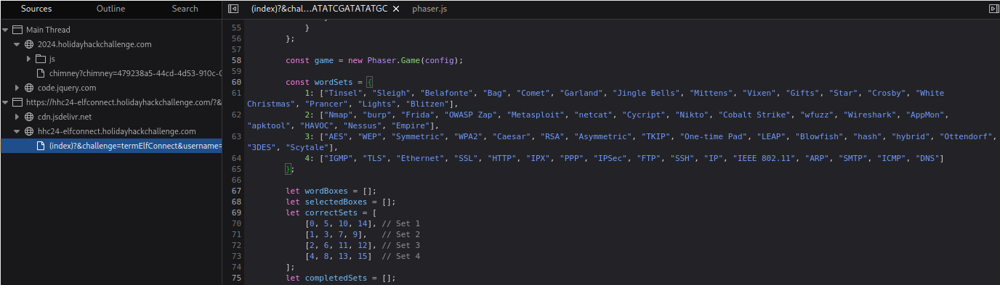
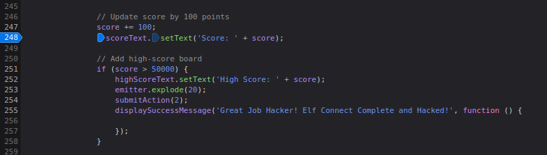
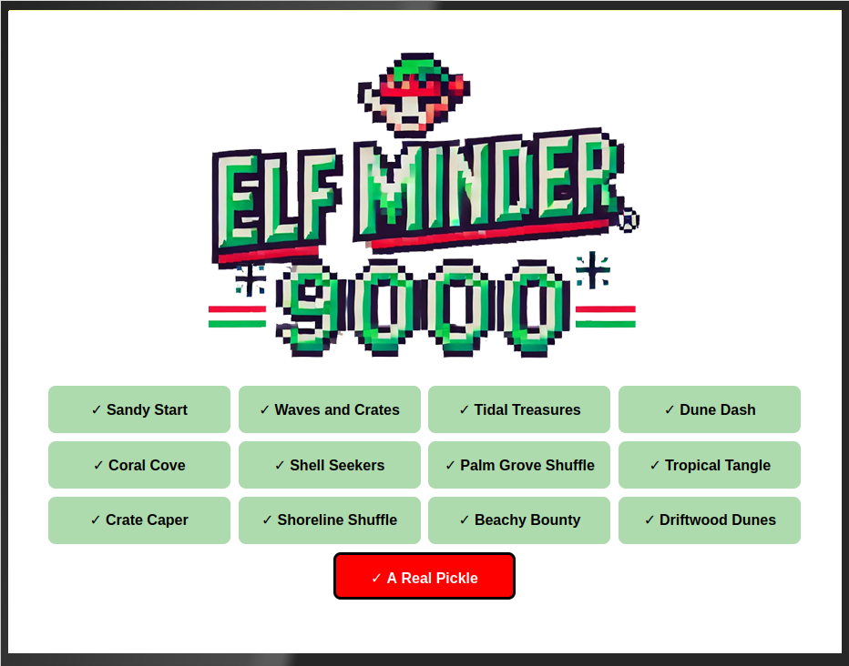
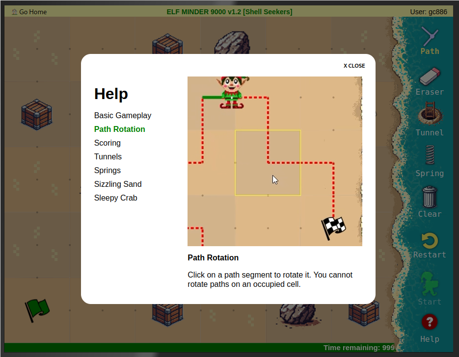
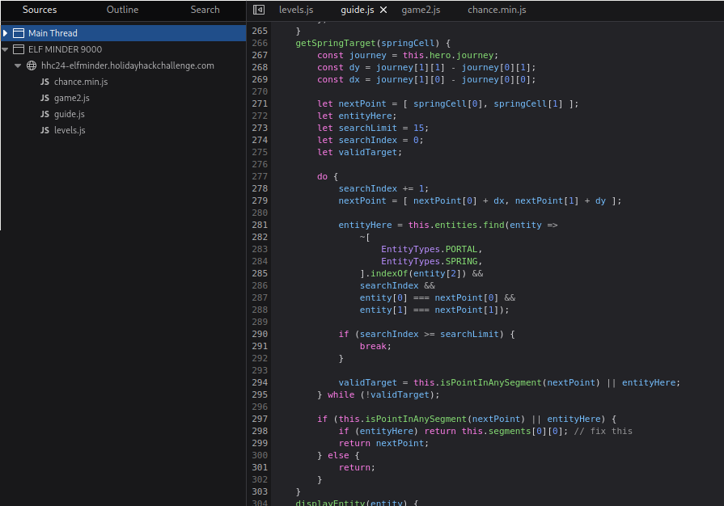
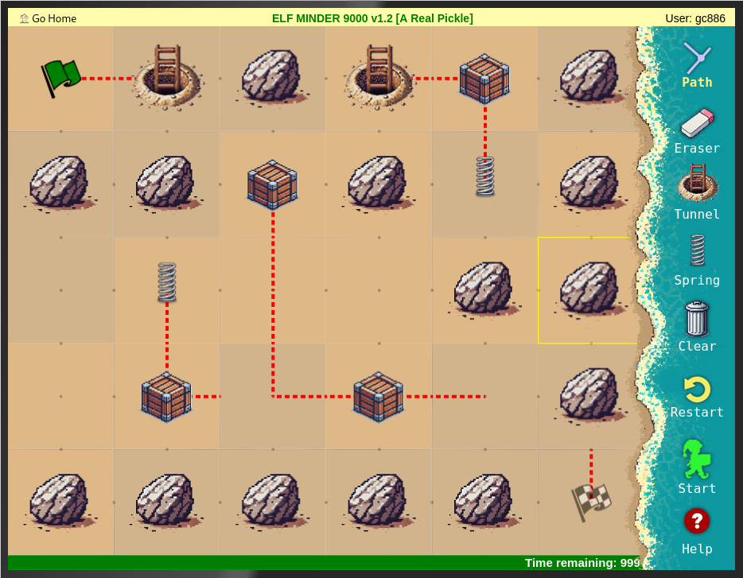
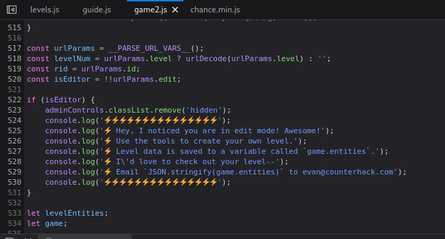
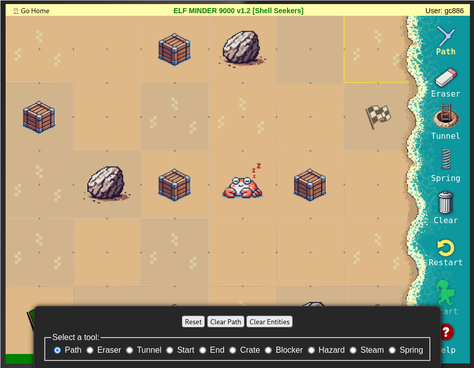

# Prologue

Here are the solutions to challenges in Prologue.

1. [First Terminal](#first-terminal)
2. [Elf Connect](#elf-connect)
3. [Elf Minder 9000](#elf-minder-9000)

## First Terminal

This challenge is meant as an orientation. A terminal is launched when the challenge is started. Simply follow the on-screen instructions and enter **answer**. There is no Gold or Silver award.



## Elf Connect

Elf Connect is based on the New York Times [Connections](https://www.nytimes.com/games/connections) game. 16 words are displayed in a grid, and the objective is to group the words into groups of 4. Each group of word should share a common theme. For this challenge, there are 4 rounds.



**FOR SILVER AWARD**, the player just needs group the words correctly in all 4 rounds.This can be rather time consuming and would involve a fair bit of guesswork, especially where certain words are unfamiliar or quite technical.

The solution can be found in the Javascript code for this challenge. Open "Developer mode" in the browser (Firefox is used here, but other mainstream browsers should work similarly) and navigate to the code for this game. This can be found in the "Debugger" tab for Firefox.



The wordsets and solution can be found from line 60 onwards. The wordsets for each round are found in the `wordSets` dictionary, while the array indices for the correct word groups are in the `correctSets` array.

Word list for each round in `wordSets`:

```
const wordSets = {
	1: ["Tinsel", "Sleigh", "Belafonte", "Bag", "Comet", "Garland", "Jingle Bells", "Mittens", "Vixen", "Gifts", "Star", "Crosby", "White Christmas", "Prancer", "Lights", "Blitzen"],
	2: ["Nmap", "burp", "Frida", "OWASP Zap", "Metasploit", "netcat", "Cycript", "Nikto", "Cobalt Strike", "wfuzz", "Wireshark", "AppMon", "apktool", "HAVOC", "Nessus", "Empire"],
	3: ["AES", "WEP", "Symmetric", "WPA2", "Caesar", "RSA", "Asymmetric", "TKIP", "One-time Pad", "LEAP", "Blowfish", "hash", "hybrid", "Ottendorf", "3DES", "Scytale"],
	4: ["IGMP", "TLS", "Ethernet", "SSL", "HTTP", "IPX", "PPP", "IPSec", "FTP", "SSH", "IP", "IEEE 802.11", "ARP", "SMTP", "ICMP", "DNS"]
};
```

The `correctSets` array:

```
let correctSets = [
	[0, 5, 10, 14], // Set 1
	[1, 3, 7, 9],   // Set 2
	[2, 6, 11, 12], // Set 3
	[4, 8, 13, 15]  // Set 4
];

```

A correct word group for Round 1 can be found at array indices 0, 5, 10 and 14. This corresponds to the words "Tinsel", "Garland", "Star" and "Lights". Another correct group is at array indices 1, 3, 7 and 9, which map to the words "Sleigh", "Bag", "Mittens" and "Gifts". The same goes for the other word sets.

**FOR GOLD AWARD**, refer to this hint from Angel Candysalt.

> WOW! A high score of 50,000 points! That’s way beyond the limit! With only four rounds and a max of 400 points per round, the top possible score should be 1,600 points. So, how did someone get to 50,000? Something unusual must be happening!
>
> If you're curious, you might want to check under the hood. Try opening the browser's developer tools console and looking around—there might even be a variable named 'score' that could give you some insights. Sometimes, games hold secrets for those who dig a little deeper. Give it a shot and see what you can discover!

The script increments and checks the current score near line 250. In Firefox developer mode, set a breakpoint at the `scoreText.setText()` function and play a round of the game normally. Once done with the round, execution will stop at the breakpoint. Switch to the "Console" tab of developer mode and increment the `score` variable beyond 50000 using a statement such as `score += 60000`. Then continue execution so that the condition for `score > 50000` is triggered for the Gold award.



## Elf Minder 9000

This challenge is build around a game that requires the player to lead the elf along a path from the start point to the end, picking up all the crates in the process, within a certain time limit. The player can position "tunnels" and "springs" which would help the elf reach his destination more quickly. While the game is running, the player can also rotate tiles to change the paths temporarily.





When the game is first started, the player is presented with 12 levels.

**FOR SILVER AWARD**, the player just needs to play and successfully clear all 12 levels. The score does not matter as long as the level is cleared within the time limit. Some levels require the rotation of tiles while the game is running.

Once the 12 levels are completed, the 13th level "A Real Pickle" appears. Clearing this level would get the player the **GOLD AWARD**, but it also requires the use of a certain unexpected game behaviour.

This behaviour comes from the `getSpringTarget` function in `guide.js` file. This function determines the point where the elf would land when he encounters a spring. Under normal game behaviour (and from observation of gameplay), he would land on the closest point with a path segment, in the direction of travel. However, if there is another tunnel or spring closest to the elf's position in the direction of travel, he will jump to the first path segment laid down by the player (line 298 - "fix this" comment).



This behaviour is key to successfully clearing "A Real Pickle" as the final point is blocked off by obstacles. The screenshot here shows a possible solution for this level. Note that the path leading to the end point (tile in the lower right corner) needs to be laid down FIRST in the editor before any other entities are added. Also, the tile with the L-shaped path (third from left, second from bottom) needs to be rotated in-game so that elf can reach the final crate.



### Elf Minder - alternative solution

It may be possible to clear the 12 levels for Silver (and possibly for Gold as well) with a different approach. In the Javascript file `game2.js`, the status of the constant `isEditor` is checked (line 522) and if it evaluates to `true`, an admin control panel is displayed. In Firefox developer mode, the code can be tampered with by acessing the "Debugging" tab, "Source" panel, right clicking on the `game2.js` file, and turning on the "Add script override" option. This saves the file locally and allows user modification of the script. The browser would use the copy of the script on disk instead of the original downloaded copy as long as the script override option is switched on.

In this case, to activate the admin panel, line 520 should be commented out and a new statement `isEditor = true;` added immediately after.



Once the code has been edited, run the game again and the admin panel should appear. This allows the player to remove crates and obstacles so that he game can be completed more quickly.




