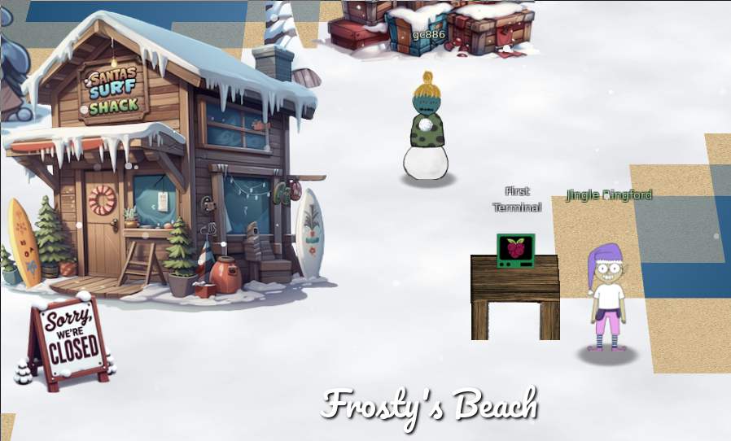

# Report for SANS Holiday Hack Challenge 2024: Snow-maggedon

Challenges in  were released in 4 parts over November and December 2024. Each challenge has an easy and a harder mode. Solving in the easy mode earns the player a "Silver" award, while the harder mode gets him a "Gold".

Links to write-ups for challenges:
1. [Prologue - all Silver and Gold](Prologue.md)
   - [First Terminal](Prologue.md#first-terminal)
   - [Elf Connect](Prologue.md#elf-connect)
   - [Elf Minder 9000](Prologue.md#elf-minder-9000)
2. [Act 1 - all Silver and Gold](Act1.md)
   - [cURLing](Act1.md#curling)
   - [Frosty Keypad](Act1.md#frosty-keypad)
   - Hardware Hacking 101
	 - [Part 1](Act1.md#hardware-hacking-part-1)
	 - [Part 2](Act1.md#hardware-hacking-part-2)
3. [Act 2 - all Silver and Gold](Act2.md)
   - [Mobile Analysis](Act2.md#mobile-analysis)
   - [Drone Path](Act2.md#drone-path)
   - [Powershell](Act2.md#powershell)
   - [Snowball Showdown](Act2.md#snowball-showdown)
   - [Microsoft KC7](Act2.md#microsoft-kc7)
	 - [Section 1: KQL 101](Act2.md#section-1-kql-101)
	 - [Section 2: Operation Surrender](Act2.md#section-2-operation-surrender)
	 - [Section 3: Operation Snowfall](Act2.md#section-3-operation-snowfall)
	 - [Section 4: Echoes in the Frost](Act2.md#section-4-echoes-in-the-frost)
4. Act 3
   - [Elf Stack - Silver and Gold](Act3-elfstack.md)

# Interesting finds

1. *Joke generating function in Act I Hardware Hacking Part 1*

